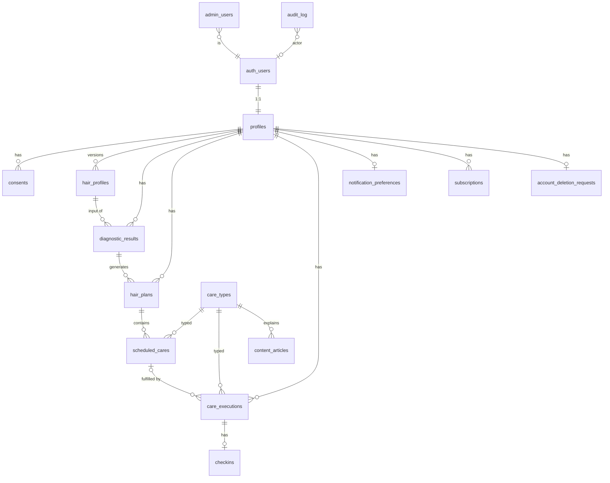

# DATA MODEL — Modelo conceitual

| Campo | Valor |
|---|---|
| Status | Draft v0.1 — **conceitual; nenhuma migration criada** |
| Relacionados | [DOMAIN-MAP](DOMAIN-MAP.md) · [SUPABASE-RLS-STRATEGY](../security/SUPABASE-RLS-STRATEGY.md) · [ADR-008 Time](../adr/ADR-008-time-and-dates.md) |

> Nomes de tabelas/colunas abaixo são **propostas** para dar precisão ao raciocínio. Só viram schema real via SPEC + migration revisada. Nada aqui autoriza um agente a criar tabelas.

---

## 1. Convenções de dados (obrigatórias)

| Convenção | Regra |
|---|---|
| Schema | Tabelas de produto em `public`; nenhum objeto de app em `auth`/`storage` além de triggers documentados |
| PK | `id uuid primary key default gen_random_uuid()` (exceto `profiles.user_id`) |
| Timestamps | `created_at timestamptz not null default now()`; `updated_at` só em tabelas mutáveis (trigger `set_updated_at`) |
| Ownership | Coluna `user_id uuid not null references auth.users(id) on delete cascade` em **toda** tabela de dados da usuária, mesmo quando derivável por FK (simplifica RLS e índices) |
| Datas locais | `date` (sem timezone) para "dia da usuária"; `timestamptz` para instantes reais; nunca `timestamp` sem tz |
| Enums | `text` + `CHECK (col in (...))` no MVP (mais fácil de migrar que `enum type`); valores em snake_case; espelhados em zod |
| JSON | `jsonb` apenas para snapshots imutáveis e atributos versionados por algoritmo; nunca para dados consultados por filtro sem índice |
| Soft delete | **Não.** Exclusão de conta usa `account_deletion_requests` (estado explícito + grace) e depois hard delete em cascade. Histórico é preservado por status, não por `deleted_at` |
| Versionamento | `algorithm_version text` em `diagnostic_results` e `hair_plans`; `version int` em `hair_profiles` |
| Status | Máquinas de estado explícitas com `CHECK`; transições validadas em RPC |
| Índices | Sempre em `(user_id, ...)` para tabelas de usuária; índices parciais para `status = 'active'` |
| Naming | snake_case; tabelas no plural; FKs `<entidade>_id`; booleans `is_` / `has_` |

## 2. Diagrama ER (conceitual)

## 3. Entidades

### 3.1 `profiles` — Identity & Account
| Coluna | Tipo | Notas |
|---|---|---|
| user_id | uuid PK, FK auth.users | criado por trigger no signup |
| display_name | text null | dado pessoal (nome/apelido) — opcional |
| timezone | text not null default 'America/Sao_Paulo' | IANA; validada |
| locale | text not null default 'pt-BR' | |
| onboarding_status | text CHECK (not_started/in_progress/completed) | |
| created_at / updated_at | | |

- **Ownership:** usuária. **Lifecycle:** criado no signup → ativo → (pedido de exclusão em `account_deletion_requests`, grace ex. 7 dias, cancelável) → hard delete cascade a partir de `auth.users`. *(Revisão v0.2: coluna `deleted_at` removida — fonte única de verdade é `account_deletion_requests`.)*
- **PII:** display_name. Email/telefone vivem apenas em `auth.users`.
- **Não armazenar:** gênero, data de nascimento completa (se necessário para ICP, usar faixa etária opcional em `hair_profiles.attributes`... ou não coletar — **decisão: não coletar no MVP**).

### 3.2 `consents`
| Coluna | Tipo |
|---|---|
| id, user_id | |
| consent_type | text CHECK (terms/privacy/analytics/marketing) |
| version | text (versão do documento aceito) |
| granted_at / revoked_at | timestamptz |

Append-only por versão; permite comprovar base legal (LGPD).

### 3.3 `hair_profiles` — Hair Profile (append-only)
| Coluna | Tipo | Notas |
|---|---|---|
| id, user_id | | |
| version | int not null | `UNIQUE (user_id, version)` |
| curl_pattern, strand_thickness, porosity, scalp_oiliness, elasticity, wash_frequency | text CHECK | colunas tipadas para as dimensões estáveis |
| chemical_treatments | text[] | valores validados por CHECK/constraint de subconjunto |
| heat_usage | text CHECK | |
| goals | text[] | |
| extra_attributes | jsonb default '{}' | atributos ainda não promovidos a coluna; schema zod versionado |
| created_at | | sem updated_at — imutável |

- **Invariante:** "perfil atual" = maior `version`. Índice `(user_id, version desc)`.
- **Atribuição de `version`:** INSERT direto pelo cliente (RLS `WITH CHECK user_id = auth.uid()`) com trigger `BEFORE INSERT` que ignora o valor enviado e define `version = max+1` sob `pg_advisory_xact_lock(hashtext(user_id::text))`. Não há RPC para isso (revisão v0.2 — evita "tudo em RPC").
- **PII:** sensibilidade baixa/média (características físicas). Tratar como dado pessoal (LGPD), não sensível de saúde.

### 3.4 `diagnostic_results` — Diagnostic (imutável)
| Coluna | Tipo | Notas |
|---|---|---|
| id, user_id | | |
| hair_profile_id | FK | |
| algorithm_version | text not null | ex. `diag-v1` |
| answers_snapshot | jsonb not null | respostas exatas usadas |
| result | jsonb not null | saída do engine (needs, reasons, flags) |
| created_at | | |

- Só escrita pelo servidor (Edge Function via service role **ou** RPC dedicada). Usuária: SELECT próprio.
- Nunca UPDATE/DELETE por usuária (exclusão só via cascade de conta).

### 3.5 `hair_plans` — Schedule (raiz do agregado)
| Coluna | Tipo | Notas |
|---|---|---|
| id, user_id | | |
| diagnostic_result_id | FK | |
| algorithm_version | text not null | ex. `sched-v1` |
| status | text CHECK (active/superseded/archived) | |
| starts_on | date not null | dia local |
| timezone | text not null | snapshot da tz no momento da geração |
| strategy | jsonb not null | padrão de ciclo (ex. sequência H,H,N,H,R), cadência, racional |
| input_snapshot | jsonb not null | contexto usado (frequência de lavagem etc.) |
| superseded_by_plan_id | FK null | |
| created_at / updated_at | | updated_at só por transição de status |

- **Invariante DB:** `CREATE UNIQUE INDEX one_active_plan_per_user ON hair_plans(user_id) WHERE status = 'active'`.
- Transição só por RPC/Edge; usuária não faz UPDATE direto.

### 3.6 `scheduled_cares` — planejado
| Coluna | Tipo | Notas |
|---|---|---|
| id, user_id, plan_id | | |
| care_type_code | FK care_types | |
| planned_date | date not null | dia local |
| sequence | int | posição no ciclo |
| status | text CHECK (planned/completed/skipped/rescheduled) | |
| rescheduled_to_id | FK scheduled_cares null | quando status = rescheduled |
| origin | text CHECK (generated/rescheduled/manual) | |
| skip_reason | text null | |
| created_at / updated_at | | |

- **Índices:** `(user_id, planned_date)`, `(plan_id, planned_date)`.
- **Invariantes:** `status='rescheduled' ⇔ rescheduled_to_id is not null` (CHECK); `status='completed'` só via `complete_care` (trigger/RPC); usuária **não** altera `planned_date` (reagendar = nova linha).
- "Atrasado" é calculado, nunca armazenado. Por D-28, não existe job/trigger que mova `planned_date` ou crie reagendamentos automáticos; toda transição de cuidado atrasado nasce de ação explícita da usuária via RPC.

### 3.7 `care_executions` — executado (append-only)
| Coluna | Tipo | Notas |
|---|---|---|
| id, user_id | | |
| scheduled_care_id | FK null | null = ad hoc |
| care_type_code | FK | redundante para ad hoc e histórico |
| client_execution_id | uuid not null **UNIQUE** | idempotência |
| executed_at | timestamptz not null | instante real |
| executed_on | date not null | dia local no momento (calculado no servidor a partir de tz enviada + validação) |
| note | text null (≤ 280) | texto livre — PII potencial; não logar |
| voided_at | timestamptz null | "desfazer" (proposta: janela de 10 min via RPC `void_execution`); execução anulada continua no histórico — **decisão pendente (DECISION-REGISTER D-12)** |
| created_at | | |

- **Invariante:** no máximo uma execução **não anulada** por `scheduled_care_id` (`UNIQUE` parcial `WHERE scheduled_care_id IS NOT NULL AND voided_at IS NULL`) — proposta: não permitir múltiplas execuções do mesmo agendamento (ad hoc cobre repetição).
- Nunca UPDATE de fatos (`executed_at`, `care_type_code`, `scheduled_care_id`). Únicos campos mutáveis: `voided_at` (RPC, janela curta) e possivelmente `note` (decidir na SPEC). Nunca DELETE pela usuária.

### 3.8 `checkins`
| Coluna | Tipo |
|---|---|
| id, user_id | |
| care_execution_id | FK **UNIQUE** (1:1) |
| hydration_feel, softness, definition, dryness | smallint CHECK 1..5, null permitido |
| note | text null (≤ 280) |
| created_at | |

### 3.9 `care_types` — catálogo (público)
| Coluna | Tipo |
|---|---|
| code | text PK (`hydration`, `nutrition`, `reconstruction`, …) |
| name, short_description | text |
| default_duration_min | int |
| sort_order | int |
| is_active | bool |

Seed versionado. Leitura pública; escrita apenas por migration/seed/admin.

### 3.10 `content_articles` — Content
| Coluna | Tipo |
|---|---|
| id | |
| care_type_code | FK null |
| slug | text UNIQUE |
| title, body_md | text |
| status | text CHECK (draft/published/archived) |
| published_at | timestamptz null |
| is_premium | bool default false |
| version | int |
| created_at / updated_at | |

Leitura: `status='published'` para todos autenticados; `is_premium` requer entitlement (RLS chama `has_entitlement('premium_content')`).

### 3.11 `notification_preferences`
| Coluna | Tipo |
|---|---|
| user_id PK | |
| enabled | bool default false (opt-in) |
| reminder_time_local | time not null default '19:00' |
| checkin_reminder_enabled | bool |
| max_per_day | smallint (regra central; default 2) |
| updated_at | |

`notification_deliveries` (registro de entregas) fica **fora do MVP** enquanto o canal for local — o SO é a fila.

### 3.12 `subscriptions` — Subscription
| Coluna | Tipo |
|---|---|
| id, user_id | |
| provider | text CHECK (revenuecat/apple/google/manual) |
| provider_subscription_id | text; UNIQUE (provider, provider_subscription_id) |
| product_code | text |
| status | text CHECK (trial/active/grace/expired/cancelled/refunded) |
| trial_ends_at, current_period_ends_at, cancelled_at | timestamptz |
| last_event_id | text (idempotência de webhook) |
| raw_last_event | jsonb (sem PII; para debug) |
| created_at / updated_at | |

- Escrita **exclusivamente** por Edge Function (service role). Usuária: SELECT próprio. Nunca INSERT/UPDATE via client.
- Entitlements derivados por função `get_my_entitlements()` / `has_entitlement(code)` — sem tabela no MVP.

### 3.13 `admin_users`
| Coluna | Tipo |
|---|---|
| user_id PK FK | |
| role | text CHECK (admin/support/content) |
| granted_by | uuid |
| created_at | |

Só escrita por migration (SQL revisado em PR). Custom claim `app_role` sincronizado por Auth Hook. Ver SECURITY-BASELINE.

### 3.14 `audit_log` (append-only)
| Coluna | Tipo |
|---|---|
| id | bigint identity |
| actor_user_id | uuid null (null = sistema) |
| actor_type | text CHECK (user/admin/system/webhook) |
| action | text (ex. `subscription.updated`, `account.deletion_requested`) |
| target_table, target_id | text |
| metadata | jsonb (sem segredos/PII além de ids) |
| created_at | |

Ninguém faz UPDATE/DELETE (nem service role por policy de app; retenção via job). INSERT somente por funções `SECURITY DEFINER` dedicadas ou service role.

### 3.15 `account_deletion_requests`
| Coluna | Tipo |
|---|---|
| user_id PK | |
| requested_at | timestamptz |
| scheduled_purge_at | timestamptz |
| status | text CHECK (pending/cancelled/completed) |

## 4. Matriz de dados pessoais (LGPD)

| Dado | Tabela | Categoria | Necessário? | Retenção | Exportável |
|---|---|---|---|---|---|
| Email / senha hash / provider ids | auth.users | Identificação | Sim (conta) | Até exclusão | Email sim |
| display_name | profiles | Identificação | Opcional | Até exclusão | Sim |
| timezone / locale | profiles | Técnico | Sim | Até exclusão | Sim |
| Características do cabelo | hair_profiles | Pessoal (não sensível) | Sim (core) | Até exclusão | Sim |
| Respostas/diagnóstico | diagnostic_results | Pessoal derivado | Sim | Até exclusão | Sim |
| Planos e execuções | hair_plans, scheduled_cares, care_executions | Comportamental | Sim | Até exclusão | Sim |
| Notas livres | care_executions.note, checkins.note | Pessoal (potencialmente sensível — texto livre) | Opcional | Até exclusão | Sim; **nunca em logs/analytics** |
| Assinatura | subscriptions | Financeiro (sem cartão) | Sim | Até exclusão + obrigação fiscal (avaliar) | Sim (status) |
| Eventos analytics | provedor externo | Comportamental pseudonimizado | Sim (com consentimento) | Política do provedor; ≤ 12 meses proposto | Não (pseudônimo) |
| Fotos | — | **Não coletado no MVP** | — | — | — |

**Exclusão:** `request_account_deletion()` (SECURITY DEFINER, justificado) → grace → job purga `auth.users` (cascade) + solicita exclusão no provedor de analytics/billing por runbook.
**Exportação:** RPC `export_my_data()` retorna JSON das tabelas próprias (fase pós-MVP inicial; arquitetura pronta porque tudo tem `user_id`).

## 5. Invariantes que o banco protege (resumo)

1. Um plano ativo por usuária (índice parcial único).
2. Execução idempotente (`client_execution_id` único).
3. Check-in 1:1 com execução.
4. Versão de perfil única por usuária.
5. Enums fechados (CHECK).
6. Reagendamento consistente (CHECK status ⇔ rescheduled_to_id).
7. Toda linha de usuária tem `user_id` NOT NULL com FK cascade.
8. `algorithm_version` NOT NULL onde aplicável.
9. Assinaturas só mudam via servidor (ausência de policy de escrita para `authenticated`).
10. `audit_log` append-only.

## 6. Decisões em aberto (para SPECs)
- Permitir "desfazer execução"? (proposta: sim, 10 min, via `voided_at` — ver DECISION-REGISTER D-12).
- Janela de geração de `scheduled_cares` (proposta: 8 semanas, estendida por job/on-demand).
- Streaks: **DEFERRED (D-25)** — nenhuma tabela/campo de streak no MVP; se necessário, derivar de `care_executions`.
