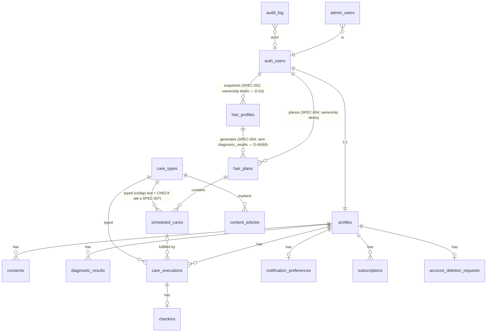

# DATA MODEL — Modelo conceitual

| Campo | Valor |
|---|---|
| Status | Draft v0.1 — **conceitual; nenhuma migration criada** |
| Relacionados | [DOMAIN-MAP](DOMAIN-MAP.md) · [SUPABASE-RLS-STRATEGY](../security/SUPABASE-RLS-STRATEGY.md) · [ADR-008 Time](../adr/ADR-008-time-and-dates.md) |

> Nomes de tabelas/colunas abaixo são **propostas** para dar precisão ao raciocínio. Só viram schema real via SPEC + migration revisada. Nada aqui autoriza um agente a criar tabelas.

---

## 1. Convenções de dados (obrigatórias)

| Convenção | Regra |
|---|---|
| Schema | Tabelas de produto em `public`; nenhum objeto de app em `auth`/`storage` além de triggers documentados |
| PK | `id uuid primary key default gen_random_uuid()` (exceto `profiles.user_id`) |
| Timestamps | `created_at timestamptz not null default now()`; `updated_at` só em tabelas mutáveis (trigger `public.set_updated_at()` — criada em `supabase/migrations/20260826000000_foundation.sql`, SECURITY INVOKER) |
| Ownership | Coluna `user_id uuid not null references auth.users(id) on delete cascade` em **toda** tabela de dados da usuária, mesmo quando derivável por FK (simplifica RLS e índices) |
| Datas locais | `date` (sem timezone) para "dia da usuária"; `timestamptz` para instantes reais; nunca `timestamp` sem tz |
| Enums | `text` + `CHECK (col in (...))` no MVP (mais fácil de migrar que `enum type`); valores em snake_case; espelhados em zod |
| JSON | `jsonb` apenas para snapshots imutáveis e atributos versionados por algoritmo; nunca para dados consultados por filtro sem índice |
| Soft delete | **Não.** Exclusão de conta usa `account_deletion_requests` (estado explícito + grace) e depois hard delete em cascade. Histórico é preservado por status, não por `deleted_at` |
| Versionamento | `assessment_algorithm_version` + `schedule_algorithm_version` (text) em `hair_plans`; `hair_profiles` sem numeração (snapshots por `id` — D-64) |
| Status | Máquinas de estado explícitas com `CHECK`; transições validadas em RPC |
| Índices | Sempre em `(user_id, ...)` para tabelas de usuária; índices parciais para `status = 'active'` |
| Naming | snake_case; tabelas no plural; FKs `<entidade>_id`; booleans `is_` / `has_` |

## 2. Diagrama ER (conceitual)

## 3. Entidades

### 3.1 `profiles` — Identity & Account
| Coluna | Tipo | Notas |
|---|---|---|
| user_id | uuid PK, FK auth.users | **entidade conceitual/futura** — **NÃO** criada pela SPEC-002 (D-63): nasce numa SPEC futura quando houver requisito concreto (ex.: `timezone` para Schedule, SPEC-004). Dados de produto ancoram direto em `auth.users` até lá; sem trigger em `auth.users` |
| display_name | text null | dado pessoal (nome/apelido) — opcional |
| timezone | text not null default 'America/Sao_Paulo' | IANA; validada |
| locale | text not null default 'pt-BR' | |
| onboarding_status | text CHECK (not_started/in_progress/completed) | |
| created_at / updated_at | | |

- **Ownership:** usuária. **Lifecycle:** criado numa SPEC futura (não SPEC-002 — D-63) → ativo → (pedido de exclusão em `account_deletion_requests`, cancelável; política de purga pendente — D-55) → hard delete cascade a partir de `auth.users`. *(Revisão v0.2: coluna `deleted_at` removida — fonte única de verdade é `account_deletion_requests`.)*
- **PII:** display_name. Email/telefone vivem apenas em `auth.users`.
- **Não armazenar:** gênero, data de nascimento completa (se necessário para ICP, usar faixa etária opcional em `hair_profiles.attributes`... ou não coletar — **decisão: não coletar no MVP**).

### 3.2 `consents`
| Coluna | Tipo |
|---|---|
| id, user_id | |
| consent_type | text CHECK (terms/privacy/analytics/marketing) |
| version | text (versão do documento aceito) |
| granted_at / revoked_at | timestamptz |

Append-only por versão; permite comprovar base legal (LGPD).

### 3.3 `hair_profiles` — Hair Profile (append-only, implementado na SPEC-002)
| Coluna | Tipo | Notas |
|---|---|---|
| id | uuid PK | identidade estável do snapshot; referenciada pelo downstream como `hair_profile_id` (D-64) |
| user_id | uuid not null, FK `auth.users` on delete cascade | ownership direto (sem `profiles` — D-63) |
| hair_pattern, strand_thickness, scalp_tendency, wash_frequency, heat_usage, primary_goal | text CHECK | 8 inputs aprovados (D-62; conjuntos em SPEC-002 §6) |
| chemical_treatments | text[] not null default '{}' | subconjunto validado; `[]` = nenhuma (sem valor `none`) |
| current_concerns | text[] not null | `cardinality>=1`; `no_major_concern` exclusivo |
| created_at | timestamptz | sem `updated_at` — imutável |

- **Invariante:** snapshots **imutáveis**; cada avaliação = nova linha; "snapshot atual" = o mais recente (`ORDER BY created_at DESC, id DESC LIMIT 1`). **Sem `version` sequencial, sem `is_current`** (D-64). Índice `(user_id, created_at desc, id desc)`.
- **Atribuição:** INSERT direto pelo cliente (RLS `WITH CHECK user_id = auth.uid()`); **sem trigger, sem advisory lock, sem RPC** (D-64). Imutabilidade por ausência de grant UPDATE/DELETE.
- **Sem** `extra_attributes` (D-64/necessity review); `porosity`/`elasticity`/`scalp_oiliness`/`density`/`goals` genérico/2A–4C **fora do MVP** (SPEC-002 §10).
- **PII:** sensibilidade baixa/média (características físicas). Tratar como dado pessoal (LGPD), não sensível de saúde.

### 3.4 `diagnostic_results` — **NÃO EXISTE** (necessity review SPEC-004 §9, D-66)
Removida do modelo: no MVP a avaliação só existe para gerar um plano, nenhuma feature a consulta isoladamente e a reprodutibilidade não exige cópia (engines determinísticos + versões liberadas imutáveis). O `AssessmentOutput` é um **artefato transitório** entre os dois engines. Reabrir só com requisito concreto (ex.: histórico de avaliação sem plano).

### 3.5 `hair_plans` — Schedule (raiz do agregado; implementado na SPEC-004)
| Coluna | Tipo | Notas |
|---|---|---|
| id | uuid PK | |
| user_id | uuid not null, FK `auth.users` on delete cascade | RLS `user_id = auth.uid()` |
| hair_profile_id | uuid not null, FK `hair_profiles` on delete cascade | proveniência do snapshot |
| starts_on | date not null | dia local da 1ª sessão (input do engine) |
| assessment_algorithm_version | text not null | provenance (§11) |
| schedule_algorithm_version | text not null | provenance (§11) |
| status | text CHECK (active/superseded) | sem `archived` no MVP |
| client_request_id | uuid not null | idempotência de `generate-plan` |
| created_at | timestamptz | sem `updated_at` (plano é histórico) |

- **Invariantes DB:** `hair_plans_one_active_per_user` (único parcial em `user_id` where `status='active'`); `UNIQUE (user_id, client_request_id)` (idempotência); `UNIQUE (id, user_id)` (alvo do FK composto de `scheduled_cares`). Índice `(user_id, created_at desc)`.
- **REMOVIDOS na necessity review (SPEC-004 §10):** `diagnostic_result_id`, `timezone`, `strategy`, `input_snapshot`, `updated_at`, `superseded_by_plan_id`. Reprodutibilidade = `hair_profile_id` + as duas versões de algoritmo.
- **Escrita só server-side:** `authenticated` tem apenas SELECT próprio; criação/supersessão exclusivamente pela RPC `create_plan_tx` (SECURITY DEFINER, EXECUTE só para `service_role`), chamada pela Edge Function `generate-plan`.

### 3.6 `scheduled_cares` — planejado (implementado na SPEC-004; colunas de execução → SPEC-005)
| Coluna | Tipo | Notas |
|---|---|---|
| id | uuid PK | |
| plan_id, user_id | FK composto `(plan_id, user_id) → hair_plans (id, user_id)` on delete cascade | o banco impede `user_id` divergir do dono do plano (SPEC-004 AC13); `user_id` também FK `auth.users` |
| care_type_code | text CHECK (hydration/nutrition/reconstruction) | conjunto aprovado em D-67; tabela/FK `care_types` → SPEC-007 |
| planned_date | date not null | dia local |
| created_at | timestamptz | |

- **Adiado para a SPEC-005 (não existe hoje):** `status`, `rescheduled_to_id`, `origin`, `skip_reason`, `updated_at`. `sequence` removido (ordem derivável de `(planned_date, id)`).
- **Escrita só server-side:** `authenticated` tem apenas SELECT próprio.
- **Índices:** `(user_id, planned_date)`, `(plan_id, planned_date)`.
- **Invariantes:** `status='rescheduled' ⇔ rescheduled_to_id is not null` (CHECK); `status='completed'` só via `complete_care` (trigger/RPC); usuária **não** altera `planned_date` (reagendar = nova linha).
- "Atrasado" é calculado, nunca armazenado. Por D-28, não existe job/trigger que mova `planned_date` ou crie reagendamentos automáticos; toda transição de cuidado atrasado nasce de ação explícita da usuária via RPC.

### 3.7 `care_executions` — executado (append-only)
| Coluna | Tipo | Notas |
|---|---|---|
| id, user_id | | |
| scheduled_care_id | FK null | null = ad hoc |
| care_type_code | FK | redundante para ad hoc e histórico |
| client_execution_id | uuid not null **UNIQUE** | idempotência |
| executed_at | timestamptz not null | instante real |
| executed_on | date not null | dia local no momento (calculado no servidor a partir de tz enviada + validação) |
| note | text null (≤ 280) | texto livre — PII potencial; não logar |
| voided_at | timestamptz null | "desfazer" (proposta: janela de 10 min via RPC `void_execution`); execução anulada continua no histórico — **decisão pendente (DECISION-REGISTER D-12)** |
| created_at | | |

- **Invariante:** no máximo uma execução **não anulada** por `scheduled_care_id` (`UNIQUE` parcial `WHERE scheduled_care_id IS NOT NULL AND voided_at IS NULL`) — proposta: não permitir múltiplas execuções do mesmo agendamento (ad hoc cobre repetição).
- Nunca UPDATE de fatos (`executed_at`, `care_type_code`, `scheduled_care_id`). Únicos campos mutáveis: `voided_at` (RPC, janela curta) e possivelmente `note` (decidir na SPEC). Nunca DELETE pela usuária.

### 3.8 `checkins`
| Coluna | Tipo |
|---|---|
| id, user_id | |
| care_execution_id | FK **UNIQUE** (1:1) |
| hydration_feel, softness, definition, dryness | smallint CHECK 1..5, null permitido |
| note | text null (≤ 280) |
| created_at | |

### 3.9 `care_types` — catálogo (público)
| Coluna | Tipo |
|---|---|
| code | text PK (`hydration`, `nutrition`, `reconstruction`, …) |
| name, short_description | text |
| default_duration_min | int |
| sort_order | int |
| is_active | bool |

Seed versionado. Leitura pública; escrita apenas por migration/seed/admin.

### 3.10 `content_articles` — Content
| Coluna | Tipo |
|---|---|
| id | |
| care_type_code | FK null |
| slug | text UNIQUE |
| title, body_md | text |
| status | text CHECK (draft/published/archived) |
| published_at | timestamptz null |
| is_premium | bool default false |
| version | int |
| created_at / updated_at | |

Leitura: `status='published'` para todos autenticados; `is_premium` requer entitlement (RLS chama `has_entitlement('premium_content')`).

### 3.11 `notification_preferences`
| Coluna | Tipo |
|---|---|
| user_id PK | |
| enabled | bool default false (opt-in) |
| reminder_time_local | time not null default '19:00' |
| checkin_reminder_enabled | bool |
| max_per_day | smallint (regra central; default 2) |
| updated_at | |

`notification_deliveries` (registro de entregas) fica **fora do MVP** enquanto o canal for local — o SO é a fila.

### 3.12 `subscriptions` — Subscription
| Coluna | Tipo |
|---|---|
| id, user_id | |
| provider | text CHECK (revenuecat/apple/google/manual) |
| provider_subscription_id | text; UNIQUE (provider, provider_subscription_id) |
| product_code | text |
| status | text CHECK (trial/active/grace/expired/cancelled/refunded) |
| trial_ends_at, current_period_ends_at, cancelled_at | timestamptz |
| last_event_id | text (idempotência de webhook) |
| raw_last_event | jsonb (sem PII; para debug) |
| created_at / updated_at | |

- Escrita **exclusivamente** por Edge Function (service role). Usuária: SELECT próprio. Nunca INSERT/UPDATE via client.
- Entitlements derivados por função `get_my_entitlements()` / `has_entitlement(code)` — sem tabela no MVP.

### 3.13 `admin_users`
| Coluna | Tipo |
|---|---|
| user_id PK FK | |
| role | text CHECK (admin/support/content) |
| granted_by | uuid |
| created_at | |

Só escrita por migration (SQL revisado em PR). Custom claim `app_role` sincronizado por Auth Hook. Ver SECURITY-BASELINE.

### 3.14 `audit_log` (append-only)
| Coluna | Tipo |
|---|---|
| id | bigint identity |
| actor_user_id | uuid null (null = sistema) |
| actor_type | text CHECK (user/admin/system/webhook) |
| action | text (ex. `subscription.updated`, `account.deletion_requested`) |
| target_table, target_id | text |
| metadata | jsonb (sem segredos/PII além de ids) |
| created_at | |

Ninguém faz UPDATE/DELETE (nem service role por policy de app; retenção via job). INSERT somente por funções `SECURITY DEFINER` dedicadas ou service role.

### 3.15 `account_deletion_requests`
| Coluna | Tipo |
|---|---|
| user_id | uuid PK, FK auth.users on delete cascade |
| requested_at | timestamptz not null default now() |

**SPEC-001 (aprovada):** modelo mínimo — existência da linha = pedido ativo; cancelar = a usuária apaga a própria linha; sem coluna de status e sem `scheduled_purge_at` (a política de purga, imediata vs grace, é decisão humana pendente — D-55 — e lê `requested_at`). Escrita por acesso direto com grants mínimos (`SELECT/INSERT/DELETE` próprios, sem `UPDATE`) + RLS + PK; sem RPC. A exclusão efetiva de `auth.users` é privilegiada/server-owned (job/runbook futuro).

## 4. Matriz de dados pessoais (LGPD)

| Dado | Tabela | Categoria | Necessário? | Retenção | Exportável |
|---|---|---|---|---|---|
| Email / senha hash / provider ids | auth.users | Identificação | Sim (conta) | Até exclusão | Email sim |
| display_name | profiles | Identificação | Opcional | Até exclusão | Sim |
| timezone / locale | profiles | Técnico | Sim | Até exclusão | Sim |
| Características do cabelo | hair_profiles | Pessoal (não sensível) | Sim (core) | Até exclusão | Sim |
| Respostas/diagnóstico | diagnostic_results | Pessoal derivado | Sim | Até exclusão | Sim |
| Planos e execuções | hair_plans, scheduled_cares, care_executions | Comportamental | Sim | Até exclusão | Sim |
| Notas livres | care_executions.note, checkins.note | Pessoal (potencialmente sensível — texto livre) | Opcional | Até exclusão | Sim; **nunca em logs/analytics** |
| Assinatura | subscriptions | Financeiro (sem cartão) | Sim | Até exclusão + obrigação fiscal (avaliar) | Sim (status) |
| Eventos analytics | provedor externo | Comportamental pseudonimizado | Sim (com consentimento) | Política do provedor; ≤ 12 meses proposto | Não (pseudônimo) |
| Fotos | — | **Não coletado no MVP** | — | — | — |

**Exclusão:** pedido registrado pela usuária em `account_deletion_requests` (acesso direto, SPEC-001) → política de purga (D-55) → job privilegiado purga `auth.users` (cascade) + solicita exclusão no provedor de analytics/billing por runbook.
**Exportação:** RPC `export_my_data()` retorna JSON das tabelas próprias (fase pós-MVP inicial; arquitetura pronta porque tudo tem `user_id`).

## 5. Invariantes que o banco protege (resumo)

1. Um plano ativo por usuária (índice parcial único).
2. Execução idempotente (`client_execution_id` único).
3. Check-in 1:1 com execução.
4. `hair_profiles` imutável (append-only; sem UPDATE/DELETE); snapshot atual = mais recente por `(created_at, id)` — sem numeração de versão (D-64).
5. Enums fechados (CHECK).
6. Reagendamento consistente (CHECK status ⇔ rescheduled_to_id).
7. Toda linha de usuária tem `user_id` NOT NULL com FK cascade.
8. `algorithm_version` NOT NULL onde aplicável.
9. Assinaturas só mudam via servidor (ausência de policy de escrita para `authenticated`).
10. `audit_log` append-only.

## 6. Decisões em aberto (para SPECs)
- Permitir "desfazer execução"? (proposta: sim, 10 min, via `voided_at` — ver DECISION-REGISTER D-12).
- ~~Janela de geração de `scheduled_cares`~~ — **DECIDIDA (D-67, SPEC-004): 28 dias / 4 semanas**, gerada na criação do plano. Extensão por job/on-demand não existe no MVP.
- Streaks: **DEFERRED (D-25)** — nenhuma tabela/campo de streak no MVP; se necessário, derivar de `care_executions`.
