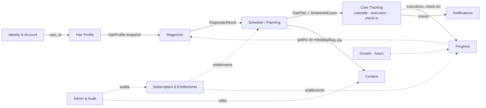

# DOMAIN MAP — Bounded Contexts

| Campo | Valor |
|---|---|
| Status | Draft v0.1 — aguardando aprovação |
| ADR | [ADR-006 Domain Boundaries](../adr/ADR-006-domain-boundaries.md) |

---

## 1. Mapa de contextos

Legenda: seta cheia = dependência de dados/fluxo; pontilhada = consulta/cross-cutting.

## 2. Alteração proposta em relação ao escopo original

| Original | Proposta | Motivo |
|---|---|---|
| `Calendar`, `Check-ins` e execução separados | Unificar em **Care Tracking** (subdomínios: calendar projection, execution, check-in) | Compartilham o mesmo agregado (ScheduledCare ↔ CareExecution ↔ CheckIn). Separar geraria 3 módulos com FK cruzada e regras duplicadas de "dia da usuária". Calendar é uma **projeção de leitura**, não um domínio |
| `Identity` inclui "perfil básico" | Identity = auth/sessão/conta; `profiles` (timezone, display name, consentimentos) fica em **Account** dentro do mesmo contexto | Timezone é dado de Account, consumido por Schedule e Notifications |
| `Growth` como módulo | Mantido só como **placeholder documental**; sem código no MVP | Evitar abstrações hipotéticas |
| `Admin` | Split em **Audit** (MVP: tabela + RPCs) e **Admin UI** (pós-MVP) | Auditoria é necessária desde o início; UI não |

## 3. Contextos

### 3.1 Identity & Account (Supporting)
- **Responsabilidade:** autenticação (delegada ao Supabase Auth), sessão, pedido de exclusão de conta (SPEC-001); perfil de aplicação (`profiles`: timezone, locale, display_name, onboarding_status), consentimentos e exportação são responsabilidades **conceituais** cuja implementação começa quando um requisito de produto as exigir (perfil: SPEC-002; consentimentos/termos: SPEC-013). *Identity authenticates the user; application profile/product data begins only when a product requirement needs it.*
- **Entidades:** `AccountDeletionRequest` (SPEC-001); `Profile` (1:1 com `auth.users`, SPEC-002); `Consent` (SPEC-013).
- **Invariantes:** quando o perfil existir, todo `auth.users` possui no máximo um `profile`, criado por comando idempotente na primeira sessão autenticada (sem trigger em `auth.users` — ADR-005 A1); timezone sempre IANA válida; exclusão efetiva de `auth.users` é privilegiada/server-owned (política imediata vs grace pendente — D-55).
- **Não faz:** autorização de negócio; regras de produto.
- **Engine em core:** apenas `TimeZone` VO e validações.

### 3.2 Hair Profile (Core)
- **Responsabilidade:** representação estruturada do cabelo e hábitos.
- **Entidade:** `HairProfile` (append-only por versão; `is_current` derivado da maior versão).
- **Value Objects (candidatos, lista não definitiva):** `CurlPattern` (liso/ondulado/cacheado/crespo + subtipo), `StrandThickness` (fino/médio/grosso), `Porosity` (baixa/média/alta/desconhecida), `ScalpOiliness`, `ChemicalTreatments` (set: descoloração, coloração, alisamento, relaxamento, nenhum), `HeatUsage` (frequência), `Elasticity`, `WashFrequency`, `Goals` (set: definição, brilho, crescimento, reduzir frizz, recuperar danos...), `Habits`.
- **Invariantes:** versão monotônica por usuária; enums fechados validados no banco (`CHECK`) e em zod; atributos desconhecidos permitidos como `unknown` (P02: não forçar respostas).
- **Ownership:** usuária.

### 3.3 Diagnostic (Core — regras)
- **Responsabilidade:** `HairProfile` + `DiagnosticAnswers` + `algorithm_version` → `DiagnosticResult`.
- **Domain Service:** `DiagnosticEngine.run(input): DiagnosticResult` — **puro, determinístico, sem I/O**.
- **Saída (conceitual):** necessidades por eixo (hidratação/nutrição/reconstrução: baixa/média/alta), fatores explicativos (`reasons[]` legíveis), flags (ex.: `heat_damage`, `chemical_damage`), confiança.
- **Invariantes:** resultado imutável; sempre carrega `algorithm_version`; a mesma entrada + mesma versão ⇒ mesma saída (testado por golden tests).
- **Versionamento:** `packages/core/src/diagnostic/versions/v1.ts` … Versões antigas permanecem no código enquanto existirem resultados que as referenciam (ou até migração explícita).

### 3.4 Schedule / Planning (Core — regras)
- **Responsabilidade:** `DiagnosticResult` + contexto (frequência de lavagem, data de início, timezone, preferências) → `HairPlan` + `ScheduledCare[]`.
- **Domain Service:** `ScheduleEngine.generate(input): { plan, cares }` — puro; o "hoje" é **injetado** (`referenceDate`), nunca lido do relógio.
- **Agregado:** `HairPlan` (raiz) → `ScheduledCare` (filhos gerados na criação para uma janela — ex. 8 semanas — e estendidos por regeneração).
- **Invariantes:** um único plano `active` por usuária; plano nunca é editado retroativamente — reavaliação cria novo plano e marca o antigo `superseded`; `ScheduledCare` planejado no passado quando plano é superseded permanece (histórico); `algorithm_version` obrigatório.
- **Domain Events (conceituais):** `PlanGenerated`, `PlanSuperseded`.

### 3.5 Care Tracking (Core)
- **Responsabilidade:** o que foi planejado vs. o que foi feito; check-ins; projeção de calendário e "Today".
- **Entidades:** `ScheduledCare` (planejado, do agregado HairPlan), `CareExecution` (feito — raiz própria, append-only), `CheckIn` (1:1 opcional com execução).
- **Regras centrais:**
  - Executar é idempotente por `client_execution_id`.
  - Reagendar preserva a `ScheduledCare` original (`status = rescheduled`, `rescheduled_to_id`) e cria uma nova (`origin = rescheduled`). **Fronteira:** Schedule *cria* cuidados (engine); Care Tracking *transita* status e cria linhas de reagendamento — o engine nunca é invocado para reagendar.
  - Pular: `status = skipped` + motivo opcional; não gera execução.
  - Execução sem agendamento (ad hoc) é permitida (`scheduled_care_id NULL`, `care_type` obrigatório).
  - "Atrasado" = planned_date < user_today e sem execução e status = planned. **Calculado**, não armazenado.
  - **Cuidado atrasado (decisão humana D-28):** o sistema **nunca** altera silenciosamente o cronograma. A UI mostra o estado ("Hidratação — atrasada há 1 dia") e pede decisão explícita: `[Fazer hoje]` (execução vinculada ao agendamento original, `executed_on` = hoje) · `[Reagendar]` (nova linha) · `[Pular]` (status skipped). Nenhum deslocamento automático do plano sem ação da usuária ou regra futura explicitamente aprovada.
- **Application Services:** `getToday(userId, referenceDate)`, `completeCare`, `rescheduleCare`, `skipCare`, `submitCheckIn`.
- **Projeção de calendário:** consulta read-only (`view` ou query) combinando planejado + executado por dia local.

### 3.6 Progress (Supporting)
- **Responsabilidade:** adesão (executados / planejados), histórico, streaks (se aprovado), indicadores de check-in ao longo do tempo.
- **Implementação:** cálculos em `core/progress` a partir de dados de Care Tracking; nada persistido no MVP além do que já existe (evitar tabela de "stats" desnormalizada até haver necessidade).
- **Entitlement:** insights avançados são premium — verificação central.

### 3.7 Notifications (Supporting)
- **Responsabilidade:** decidir **o que** lembrar (intent) separado de **como** entregar (channel/delivery).
- **Modelo:** `NotificationIntent` (tipo: `care_today`, `care_overdue`, `checkin_pending`, `reassessment_due`, `habit_recovery`; scheduled_for local) → `NotificationChannel` (`local`, futuro `push`, `email`) → `NotificationDelivery` (registro do que foi agendado/enviado).
- **MVP:** intents calculados em `core/notifications` (puro) a partir do plano + preferências; entrega via **notificações locais do SO** (adapter em infrastructure). Ver [ADR-009](../adr/ADR-009-notification-architecture.md).
- **Invariantes:** limite de N notificações/dia por regra central; respeita opt-in e janela de horário; nada é enviado sem preferência explícita.

### 3.8 Content (Supporting)
- **Responsabilidade:** conteúdo contextual por `care_type` (o que é, como fazer, erros comuns, duração).
- **Entidades:** `CareType` (catálogo), `ContentArticle` (por care_type, status draft/published, versão).
- **MVP:** seed versionado no repositório (`supabase/seed/`); leitura pública apenas de `published`. Preparado para CMS/admin.

### 3.9 Subscription & Entitlements (Supporting — segurança crítica)
- **Responsabilidade:** refletir estado de assinatura vindo do provider; derivar entitlements.
- **Entidades:** `Subscription` (escrita apenas via webhook/service role), `Entitlement` (derivado — função, não tabela, no MVP).
- **Catálogo de entitlements (inicial):** `advanced_insights`, `plan_customization`, `premium_content`. Nomeados por **capacidade**, nunca por plano.
- **Regras:** `EntitlementService.can(entitlement)` no core; fonte de verdade = `get_my_entitlements()` no servidor; RLS/RPC de recursos premium verificam entitlement server-side.
- Ver [ADR-011](../adr/ADR-011-subscription-entitlements.md).

### 3.10 Growth (Generic — futuro)
- Placeholder: share cards, referral, deep links, attribution. Sem código no MVP. Deep links terão SPEC própria com validação de parâmetros (threat model).

### 3.11 Admin & Audit
- **Audit (MVP):** `audit_log` append-only, escrito por RPCs/Edge Functions para: mudanças de assinatura, exclusão de conta, mudanças de conteúdo, concessão de role admin, execuções de operação.
- **Admin (pós-MVP):** app separado; custom claims; MFA; policies próprias (`is_admin()` baseada em claim + tabela `admin_users`).

## 4. Relações entre contextos (context mapping)

| Upstream → Downstream | Tipo | Contrato |
|---|---|---|
| Hair Profile → Diagnostic | Conformist | `HairProfileSnapshot` (tipo em core) |
| Diagnostic → Schedule | Conformist | `DiagnosticResult` (tipo versionado) |
| Schedule → Care Tracking | Shared kernel (mesmo package) | `ScheduledCare` |
| Care Tracking → Progress / Notifications | Published language (read models) | queries/views |
| Subscription → todos (entitlements) | Anti-corruption layer | `EntitlementService`; provider nunca vaza |
| Billing Provider → Subscription | ACL (webhook adapter) | Edge Function traduz payload → `Subscription` |

## 5. O que fica em `packages/core` vs. `apps/mobile`

| Em `packages/core` (puro) | Em `apps/mobile` |
|---|---|
| Entidades, VOs, enums, schemas zod | Telas, componentes, hooks |
| DiagnosticEngine, ScheduleEngine (todas as versões) | Adapters Supabase (repositories) |
| Regras de Progress, Notifications intents, Entitlements | Adapter de notificações locais |
| Catálogo de eventos analytics (tipos) | Adapter analytics/crash |
| Erros tipados | Navegação, estado UI |
| Ports (interfaces) dos repositórios | Implementações dos ports |
