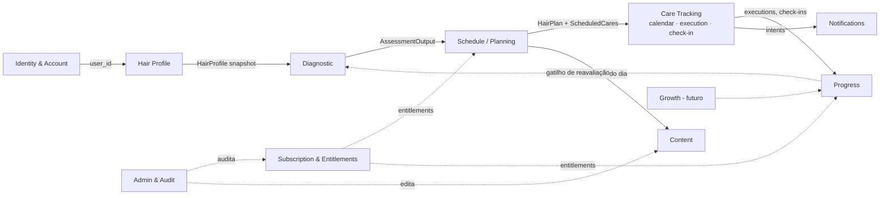

# DOMAIN MAP — Bounded Contexts

| Campo | Valor |
|---|---|
| Status | Draft v0.1 — aguardando aprovação |
| ADR | [ADR-006 Domain Boundaries](../adr/ADR-006-domain-boundaries.md) |

---

## 1. Mapa de contextos

Legenda: seta cheia = dependência de dados/fluxo; pontilhada = consulta/cross-cutting.

## 2. Alteração proposta em relação ao escopo original

| Original | Proposta | Motivo |
|---|---|---|
| `Calendar`, `Check-ins` e execução separados | Unificar em **Care Tracking** (subdomínios: calendar projection, execution, check-in) | Compartilham o mesmo agregado (ScheduledCare ↔ CareExecution ↔ CheckIn). Separar geraria 3 módulos com FK cruzada e regras duplicadas de "dia da usuária". Calendar é uma **projeção de leitura**, não um domínio |
| `Identity` inclui "perfil básico" | Identity = auth/sessão/conta; `profiles` (timezone, display name, consentimentos) fica em **Account** dentro do mesmo contexto | Timezone é dado de Account, consumido por Schedule e Notifications |
| `Growth` como módulo | Placeholder até a SPEC-044, que o **ativou** com `packages/core/src/sharing` (`F45`/`F46`) | Nasceu vazio para evitar abstração hipotética; ganhou código quando houve capability real |
| `Admin` | Split em **Audit** (MVP: tabela + RPCs) e **Admin UI** (pós-MVP) | Auditoria é necessária desde o início; UI não |

## 3. Contextos

### 3.1 Identity & Account (Supporting)
- **Responsabilidade:** autenticação (delegada ao Supabase Auth), sessão, pedido de exclusão de conta (SPEC-001); perfil de aplicação (`profiles`: timezone, locale, display_name, onboarding_status), consentimentos e exportação são responsabilidades **conceituais** cuja implementação começa quando um requisito de produto as exigir (perfil: **SPEC futura, NÃO SPEC-002** — D-63; consentimentos/termos: SPEC-013). *Identity authenticates the user; application profile/product data begins only when a product requirement needs it.*
- **Entidades:** `AccountDeletionRequest` (SPEC-001); `Profile` (1:1 com `auth.users`, **SPEC futura — D-63**); `Consent` (SPEC-013).
- **Invariantes:** quando o perfil existir, todo `auth.users` possui no máximo um `profile`, criado por comando idempotente na primeira sessão autenticada (sem trigger em `auth.users` — ADR-005 A1); timezone sempre IANA válida; exclusão efetiva de `auth.users` é privilegiada/server-owned (política imediata vs grace pendente — D-55).
- **Não faz:** autorização de negócio; regras de produto.
- **Engine em core:** apenas `TimeZone` VO e validações.

### 3.2 Hair Profile (Core)
- **Responsabilidade:** representação estruturada do cabelo e hábitos.
- **Entidade:** `HairProfile` (append-only; **snapshots imutáveis identificados por `id`**; snapshot atual = o mais recente por `(created_at, id)` — sem `version`/`is_current`, D-64).
- **Value Objects (aprovados na SPEC-002 §6 — D-62):** `hair_pattern`, `strand_thickness`, `scalp_tendency`, `wash_frequency`, `chemical_treatments` (multi), `heat_usage`, `current_concerns` (multi), `primary_goal`. Refinamentos como porosidade/elasticidade/2A–4C ficam **fora do MVP** (SPEC-002 §10). Conteúdo é input de produto, não diagnóstico (D-26).
- **Invariantes:** snapshots imutáveis (sem UPDATE/DELETE); enums fechados validados no banco (`CHECK`) e em zod; `unknown`/`varies` permitidos onde aprovado (P02: não forçar respostas).
- **Ownership:** usuária.

### 3.3 Diagnostic / Assessment (Core — regras; implementado na SPEC-004, reavaliação na SPEC-014)
- **Responsabilidade:** `HairProfileSnapshot` → `AssessmentOutput`. Termo de produto: **"avaliação capilar"** (cosmética), nunca diagnóstico médico (D-26).
- **Domain Service:** `assess(snapshot): AssessmentOutput` — **puro, determinístico, sem I/O**.
- **Saída (implementada):** `{ emphasis: hydration|nutrition|balanced, includeReconstruction: boolean, evidenceCodes: string[] }`. Só **inferências**: dado observado o Schedule lê do snapshot. **Sem** níveis, score, porcentagem ou `confidence` (falsa precisão proibida — D-66).
- **Invariantes:** mesma entrada + mesma versão ⇒ mesma saída (golden tests); o resultado é **transitório** — não há tabela `diagnostic_results` (necessity review SPEC-004 §9).
- **Versionamento:** `packages/core/src/diagnostic/engine/v1/` (diretório imutável após release); versão atual exportada como `CURRENT_ASSESSMENT_VERSION` e gravada em `hair_plans.assessment_algorithm_version`. Regras em `engine/v1/rules.ts` com `validation_status` (hoje `candidate` — D-67).

### 3.4 Schedule / Planning (Core — regras; implementado na SPEC-004)
- **Responsabilidade:** `AssessmentOutput` + contexto (`HairProfileSnapshot` para o dado observado, `startsOn`) → `HairPlanDraft` + `ScheduledCareDraft[]`.
- **Domain Service:** `generateSchedule(assessment, context): { plan, cares, evidenceCodes }` — puro; o "hoje" é **injetado** (`startsOn`), nunca lido do relógio. `buildPlan(snapshot, startsOn)` é a composição única usada pelo preview do cliente **e** pela Edge Function (mesma lógica autoritativa).
- **Agregado:** `HairPlan` (raiz) → `ScheduledCare` (filhos gerados na criação para uma janela de **28 dias** — D-67).
- **Invariantes:** um único plano `active` por usuária (índice único parcial no banco); plano nunca é editado retroativamente — reavaliação cria novo plano e marca o antigo `superseded`; `ScheduledCare` de plano superseded permanece (histórico); as **duas** versões de algoritmo são obrigatórias no plano.
- **Versionamento:** `packages/core/src/schedule/engine/v1/`; `CURRENT_SCHEDULE_VERSION` gravado em `hair_plans.schedule_algorithm_version`.
- **Domain Events (conceituais):** `PlanGenerated`, `PlanSuperseded`.

### 3.5 Care Tracking (Core — implementado na SPEC-005)
- **Responsabilidade:** o que foi planejado vs. o que foi feito; check-ins; projeção de calendário e "Today".
- **Entidades:** `ScheduledCare` (planejado, do agregado HairPlan), `CareExecution` (feito — raiz própria, append-only), `CheckIn` (1:1 opcional com execução).
- **Regras centrais:**
  - Executar é idempotente por `client_execution_id`; **0 ou 1 execução efetiva** por `ScheduledCare` (D-69/D-35), garantido por índice único parcial no banco.
  - **Concluído é derivado** da existência de execução efetiva — não existe `status='completed'` (D-69). Completar **não** altera a linha planejada, então pular/reagendar checam também a ausência de execução efetiva.
  - **Desfazer** (D-69/D-12): 15 minutos a partir de `executed_at`, medidos pelo relógio do servidor; a execução anulada permanece no histórico (`voided_at`) e o cuidado volta a ser acionável.
  - Reagendar preserva a `ScheduledCare` original (`status = rescheduled`, `rescheduled_to_id`) e cria uma nova (`origin = rescheduled`). **Fronteira:** Schedule *cria* cuidados (engine); Care Tracking *transita* status e cria linhas de reagendamento — o engine nunca é invocado para reagendar.
  - Pular: `status = skipped` + motivo opcional; não gera execução.
  - Execução sem agendamento (ad hoc) é permitida (`scheduled_care_id NULL`, `care_type` obrigatório).
  - "Atrasado" = planned_date < user_today e sem execução e status = planned. **Calculado**, não armazenado.
  - **Cuidado atrasado (decisão humana D-28):** o sistema **nunca** altera silenciosamente o cronograma. A UI mostra o estado ("Hidratação — atrasada há 1 dia") e pede decisão explícita: `[Fazer hoje]` (execução vinculada ao agendamento original, `executed_on` = hoje) · `[Reagendar]` (nova linha) · `[Pular]` (status skipped). Nenhum deslocamento automático do plano sem ação da usuária ou regra futura explicitamente aprovada.
- **Check-in (SPEC-006):** `CheckIn` é 1:1 com uma `CareExecution` **efetiva** — uma pergunta ("Como ficou?", 1..5), obrigatória, sem texto livre. Ancorado à execução e não ao cuidado planejado: desfazer deixa o check-in na execução anulada e a substituta nasce sem um. Append-only; escrita só pela RPC `submit_checkin`.
- **Application Services (implementados):** `buildTodayView(cares, executions, today, checkIns)` puro em `packages/core/src/care-tracking/` (o "hoje" é input, ADR-008); `canCheckIn(item)`; transições pelas RPCs `complete_care`, `skip_care`, `reschedule_care`, `void_execution`, `submit_checkin`.
- **Projeção de calendário:** derivada em memória por `buildTodayView` (sem view no banco). Grade mensal fica fora da SPEC-005.

### 3.6 Progress (Supporting — implementado na SPEC-009)
- **Responsabilidade:** transformar fatos já registrados num resumo compreensível. Adesão ao plano ativo, pulados e como ela avaliou os cuidados.
- **Implementação:** `buildProgress(view)` puro em `packages/core/src/progress/`, derivado do **mesmo `TodayView`** que a tela usa — **nada persistido** (sem tabela, view, agregado ou cache), como já previa este documento.
- **Por que o read model e não linhas cruas:** desfecho, "reagendado não conta" e "execução anulada leva o check-in junto" já foram decididos em Care Tracking; recalcular criaria segunda fonte de verdade (D-69).
- **Invariantes:** cuidado futuro nunca conta como falha; reagendado nunca conta (a linha substituta conta); execução anulada devolve o cuidado a não concluído e remove o check-in dela; **nenhum número inferido** (D-26) — sem score, porcentagem, tendência ou claim causal; média de check-in é **auto-relato**, retida abaixo de 3 respostas; divisão por zero impossível por construção.
- **Recorte:** plano ativo, dito na tela ("Neste plano"), **mais o total vitalício** de execuções efetivas atravessando planos superseded (SPEC-014) — mostrado só quando é maior que o do plano atual, para não repetir número. Sem ele, a primeira reavaliação faria tudo que ela fez sumir de vista.
- **Streaks:** continuam DEFER (D-25). **Entitlement:** insights avançados são premium — SPEC-010.

### 3.7 Notifications (Supporting — implementado na SPEC-008)
- **Responsabilidade:** decidir **o que** lembrar (intent) separado de **como** entregar (channel/delivery).
- **Modelo:** `NotificationIntent` (tipo: `care_today`, `care_overdue`, `checkin_pending`, `reassessment_due`, `habit_recovery`; scheduled_for local) → `NotificationChannel` (`local`, futuro `push`, `email`) → `NotificationDelivery` (registro do que foi agendado/enviado).
- **MVP:** intents calculados em `core/notifications` (puro) a partir do plano + preferências; entrega via **notificações locais do SO** (adapter em infrastructure). Ver [ADR-009](../adr/ADR-009-notification-architecture.md).
- **Implementado (SPEC-008):** `buildNotificationIntents({ view, preferences, today, nowLocalTime })` puro em `packages/core/src/notifications/` — recebe o `TodayView` (published language de Care Tracking) e devolve o conjunto completo de lembretes que deve existir agora. `LocalNotificationAdapter` sobre `expo-notifications` é o **único** arquivo que conhece o SO (D-22).
- **Intents implementados:** `care_today`, `care_overdue`, `checkin_pending`. **`reassessment_due` é impossível hoje** (não existe reavaliação — SPEC-014) e **`habit_recovery` fica adiado** (dispara justamente quando ela não está usando o app, sem dado que justifique) — SPEC-008 §4.
- **Invariantes:** opt-in duplo (preferência ligada **e** permissão do SO); no máximo **2 por dia** (constante no core, não coluna); horizonte de **14 dias**; nunca lembra de cuidado já concluído, pulado ou reagendado; nunca agenda no passado; texto de **catálogo fixo** parametrizado só por contagem — sem PII na tela de bloqueio.
- **Reconciliação idempotente:** id determinístico `tipo:data`; cancela tudo e reagenda a cada mudança do board ou da preferência. Notificação **nunca** altera estado — D-28 continua valendo.

### 3.8 Content (Supporting — implementado na SPEC-007)
- **Responsabilidade:** conteúdo contextual por `care_type` (o que é, como fazer, erros comuns, duração).
- **Entidades:** `CareGuide` — um por `CareTypeCode`, exaustivo por `Record<CareTypeCode, CareGuide>` (um care type novo quebra o build até ganhar guia). `CareType`/`ContentArticle` como tabelas **não existem** (D-71).
- **Onde vive:** `packages/core/src/content/` (`domain/care-guide.ts`, `v1/guides.ts`), **no bundle** — não no banco. Disponível offline, sem loading, sem erro, sem retry, sem policy ou grant novos. Gatilho para migrar para tabela em SPEC-007 §8.2 / DATA-MODEL §3.9-3.10.
- **Fronteira:** o conjunto de `CareTypeCode` pertence à Schedule (SPEC-004). Content **consome**, nunca estende. Conteúdo **não é regra executável**: nenhum guia influencia avaliação, cronograma, datas ou transições — trocar um texto nunca altera o plano de ninguém.
- **Governança (D-26 / ADR-007 A1, aplicada ao texto por D-70):** todo guia declara `validationStatus` e `rationaleSource`. Conteúdo escrito pela engenharia nasce `candidate` — dev/internal beta liberados, **PUBLIC RELEASE bloqueado** até o sign-off de domínio (OQ-REL). O texto é procedimental e cosmético: sem marca, produto comercial, dosagem química, promessa de resultado ou linguagem de diagnóstico, e o tempo de pausa remete sempre à embalagem do produto da usuária (verificado por teste).
- **Consumo:** `TodayScreen` mostra "Como fazer" nos cuidados acionáveis (SPEC-007 §14). Premium (`is_premium`) e CMS continuam fora — SPEC-010 e pós-MVP.

### 3.9 Subscription & Entitlements (Supporting — segurança crítica)
- **Responsabilidade:** refletir estado de assinatura vindo do provider; derivar entitlements.
- **Entidades:** `Subscription` (escrita apenas via webhook/service role), `Entitlement` (derivado — função, não tabela, no MVP).
- **Catálogo de entitlements (inicial):** `advanced_insights`, `plan_customization`, `premium_content`. Nomeados por **capacidade**, nunca por plano.
- **Regras:** `EntitlementService.can(entitlement)` no core; fonte de verdade = `get_my_entitlements()` no servidor.
- ⚠️ **Onde o entitlement é ENFORÇADO varia com a capability, e a diferença precisa estar dita:**
  - **Gate de efeito** — o servidor decide e o cliente não consegue contornar. É o caso do
    `plan_customization`: a `generate-plan` consulta `has_entitlement` e simplesmente **não aplica**
    os dias preferidos de quem não tem (SPEC-015 FR3).
  - **Gate de apresentação** — a origem do entitlement é o servidor, mas o **efeito** é uma leitura
    no aparelho sobre dados que já são dela. É o caso do `advanced_insights` (SPEC-047 §6): um
    cliente adulterado computaria as mesmas observações **sobre o próprio histórico**. Nada de outra
    usuária vaza, e nenhum conteúdo de servidor é exposto — mas **não** é um gate de dado, e chamá-lo
    assim seria pior que assumir o que ele é. Mover a derivação para RPC é a OQ2 da SPEC-047.
- Ver [ADR-011](../adr/ADR-011-subscription-entitlements.md).

### 3.10 Growth (Generic — **ativado** na SPEC-044)
- **Deixou de ser placeholder.** `packages/core/src/sharing` existe: o card compartilhável (`F45`) e
  os momentos que o produzem (`F46`). **Sem backend** — sem tabela, sem RPC, sem registro de "ela
  compartilhou": contar shares é analytics, e o provider não existe (D-31).
- **Ainda placeholder:** referral, deep links, attribution. Deep links terão SPEC própria com
  validação de parâmetros (threat model).

### 3.11 Journey (Supporting — implementado na SPEC-043)
- **Responsabilidade:** medir **aderência ao plano** — pontos, nível, sequência e marcos.
- ⚠️ **Não pontua o cabelo nem o ciclo.** SPEC-009/019/021 recusaram isso, e as barreiras da aba
  Progresso continuam de pé; a Jornada mede **outro objeto** e por isso tem **superfície própria**.
- **Entidade:** `journey_points` — o ponto como **fato datado**, chavado pelo **cuidado planejado**
  (nunca pela execução: refazer criaria id novo e pagaria duas vezes — SPEC-043 BR7).

### 3.12 Insights (Core do Premium — implementado na SPEC-047/SPEC-049)
- **Responsabilidade:** responder *"o que funciona comigo?"* a partir do que **ela** registrou.
- **Determinística, sem IA** (§0.4 §3.1): é a camada que a IA vai **consultar**, não o contrário.
- ⚠️ **Observação, nunca causa.** *"Esteve em 4 dos 5 cuidados que você avaliou bem"* é contagem;
  *"melhorou seu cabelo"* seria alegação capilar (D-26/D-70).
- **Sem entidade própria:** lê `care_executions`, `checkins`, `wash_days`, `wash_day_products`,
  `wash_day_techniques` e `products` sob RLS. **Não escreve nada.**

### 3.13 Oil Routine (Supporting — implementado na SPEC-040)
- **Responsabilidade:** a rotina de óleo **paralela ao cronograma** (`F39`).
- ⚠️ **Não entra no plano** (NG1): o cronograma é saída de motor versionado, e enfiar o óleo lá
  dentro faria uma escolha dela virar decisão de engine.
- **Entidades:** `oil_routines` (uma por usuária) e `oil_events`, **escrita só por RPC**, porque o
  dia civil depende do fuso dela (ADR-008).

### 3.14 Admin & Audit
- **Audit (MVP):** `audit_log` append-only, escrito por RPCs/Edge Functions para: mudanças de assinatura, exclusão de conta, mudanças de conteúdo, concessão de role admin, execuções de operação.
- **Admin (pós-MVP):** app separado; custom claims; MFA; policies próprias (`is_admin()` baseada em claim + tabela `admin_users`).

## 4. Relações entre contextos (context mapping)

| Upstream → Downstream | Tipo | Contrato |
|---|---|---|
| Hair Profile → Diagnostic | Conformist | `HairProfileSnapshot` (tipo em core) |
| Diagnostic → Schedule | Conformist | `AssessmentOutput` (tipo versionado, transitório — SPEC-004) |
| Schedule → Care Tracking | Shared kernel (mesmo package) | `ScheduledCare` |
| Care Tracking → Progress / Notifications | Published language (read models) | queries/views |
| Subscription → todos (entitlements) | Anti-corruption layer | `EntitlementService`; provider nunca vaza |
| Billing Provider → Subscription | ACL (webhook adapter) | Edge Function traduz payload → `Subscription` |

## 5. O que fica em `packages/core` vs. `apps/mobile`

| Em `packages/core` (puro) | Em `apps/mobile` |
|---|---|
| Entidades, VOs, enums, schemas zod | Telas, componentes, hooks |
| DiagnosticEngine, ScheduleEngine (todas as versões) | Adapters Supabase (repositories) |
| Regras de Progress, Notifications intents, Entitlements | Adapter de notificações locais |
| Catálogo de eventos analytics (tipos) | Adapter analytics/crash |
| Erros tipados | Navegação, estado UI |
| Ports (interfaces) dos repositórios | Implementações dos ports |
