# ENGINEERING WORKFLOW

| Campo | Valor |
|---|---|
| Status | Draft v0.1 |
| Relacionados | [SPEC System](../specs/README.md) · [ADR-003](../adr/ADR-003-repository-strategy.md) · [SECURITY-BASELINE](../security/SECURITY-BASELINE.md) |

## 1. Fluxo

```mermaid
flowchart LR
    I[Idea] --> R[Requirement<br/>issue]
    R --> A{Decisão<br/>arquitetural?}
    A -->|sim| ADR[ADR]
    A -->|não| S
    ADR --> S[SPEC Draft → Approved]
    S --> B[Branch feature/*]
    B --> IM[Implementation<br/>menor mudança segura]
    IM --> T[Tests<br/>unit · integration · RLS]
    T --> PR[Pull Request<br/>template]
    PR --> RV[Review humana<br/>+ CI verde]
    RV --> M[Merge em main<br/>squash]
    M --> ST[Deploy automático staging<br/>migrations + functions]
    ST --> SM[Smoke test staging]
    SM --> REL[Release<br/>EAS build/update + prod migrations com approval]
```

## 2. Papéis
- **Humano (owner):** aprova SPEC/ADR, revisa PR, autoriza migrations prod, aprova dependências/MCPs.
- **Agente (Claude Code):** propõe SPEC, implementa dentro do escopo, roda testes, prepara PR, reporta riscos. Nunca faz merge, deploy ou migration prod.
  **PR ownership:** an implementation task owns its PR until every required CI check is green. CI failures caused by the current work must be investigated (full logs, root cause, local reproduction when useful), fixed with the smallest correct change, committed, pushed and revalidated autonomously — never by weakening RLS/guardrails, skipping or removing tests. Human intervention is required only for an actual human gate (CLAUDE.md §0.1).

## 3. Branches e commits
- `main` protegido: PR obrigatório, ≥ 1 aprovação humana, CI verde, sem force push, linear history (squash).
- `feature/SPEC-004-schedule-engine`, `fix/...`, `chore/...`, `docs/...`.
- Conventional Commits com escopo = contexto ou área: `feat(schedule)`, `fix(auth)`, `docs(adr)`, `test(rls)`, `chore(deps)`, `db(migration)`.
- PR pequeno (< ~400 linhas de diff útil). Se maior, dividir.

## 4. Pull Request
Template em `.github/PULL_REQUEST_TEMPLATE.md`: Summary · Related SPEC · Related ADR · Changes · Security Impact · Database Impact · Screenshots · Tests · Manual Validation · Migration · Rollback · Risks.

Labels: `security` (obrigatória se toca `supabase/`, auth, RLS, Edge), `db`, `engine`, `deps`, `docs`.

## 5. CI (GitHub Actions) — proposta MVP

| Workflow | Gatilho | Passos |
|---|---|---|
| `ci.yml` | PR, push main | `pnpm install --frozen-lockfile` → `typecheck` → `lint` → `dep-cruise` → `test` (Vitest core + Jest app) → `pnpm audit --audit-level=high` → gitleaks → verificação de `database.types.ts` atualizado |
| `supabase-test.yml` | PR que toca `supabase/**` ou `packages/core/**` | `supabase start` → `db reset` (migrations + seed) → pgTAP → checks: RLS ON em todas as tabelas, `SECURITY DEFINER` allowlist, grants allowlist → `supabase functions` test |
| `supabase-deploy-staging.yml` | merge em `main` com mudanças em `supabase/**` | `supabase db push` + `functions deploy` no projeto staging (secrets via environment `staging`) |
| `supabase-deploy-prod.yml` | manual (`workflow_dispatch`) | environment `production` com required reviewers → `db push` → `functions deploy` |
| `eas.yml` (fase Release) | tag `v*` | EAS build/submit; EAS Update por canal |

Ações pinadas por SHA. Sem CI "esperta" além disso no MVP.

## 6. Ambientes

| Ambiente | Supabase | App | Dados |
|---|---|---|---|
| local | `supabase start` (Docker) | Expo dev client / Expo Go | seed |
| staging | projeto `staging` | EAS `preview` | sintéticos |
| production | projeto `prod` | store builds | reais — nunca copiados para baixo |

## 7. Migrations — fluxo detalhado
1. SPEC aprovada define schema.
2. `supabase migration new <slug>` → SQL pequeno, aditivo, com `-- ROLLBACK:` comentado.
3. `supabase db reset` local; escrever pgTAP para RLS/constraints/RPC.
4. `supabase gen types` → commit do `database.types.ts`.
5. PR com label `db` (+ `security` se RLS/função). `/migration-review` + `/rls-review`.
6. Merge → staging automático → smoke.
7. Prod: workflow manual com approval. Backup/PITR verificado antes de migration não trivial.
8. Migrations destrutivas: duas fases (expand → migrate → contract) em PRs separadas; nunca no mesmo release que o app que depende do estado antigo.

## 8. Testing pyramid

| Nível | Alvo | Ferramenta | Gate |
|---|---|---|---|
| Unit | engines (golden), regras, entitlements, time, intents, progress | Vitest em `packages/core` | CI, cobertura mínima nos engines 90% |
| Integration | RLS, RPCs, constraints, Edge Functions (com `supabase start`) | pgTAP + Deno test | CI |
| Component | lógica de tela (estados, validação) | Jest + RNTL | CI |
| E2E | signup → onboarding → diagnóstico → cronograma → concluir cuidado → check-in | Maestro (avaliar) em staging | Pré-release |
| Manual smoke | checklist por SPEC | humano | Pré-merge/release |

Regras: teste removido/skipado para passar build é proibido; flaky test é bug com prioridade.

## 9. Supply chain — checklist para nova dependência
Preencher na PR (`chore(deps)`):
- Necessidade real? Poderia ser < 50 linhas próprias?
- Manutenção (último release < 12 meses, issues respondidas), downloads, licença (MIT/Apache-2/BSD/ISC), tamanho (bundlephobia), deps transitivas, CVEs.
- Onde roda (core/app/edge)? Core aceita apenas deps puras.
- Aprovação humana explícita.

## 10. Release checklist (resumo — SPEC-013 detalha)
CI verde · staging smoke · migrations prod aplicadas · advisors Supabase limpos · privacy labels/nutrition (App Store/Play Data Safety) coerentes com DATA-MODEL §4 · política de privacidade publicada · exclusão de conta funcional · crash reporting ativo · analytics com consentimento · tag `vX.Y.Z` · notas de release.

## 11. Definition of Ready / Done
Ver [docs/specs/README.md](../specs/README.md).
