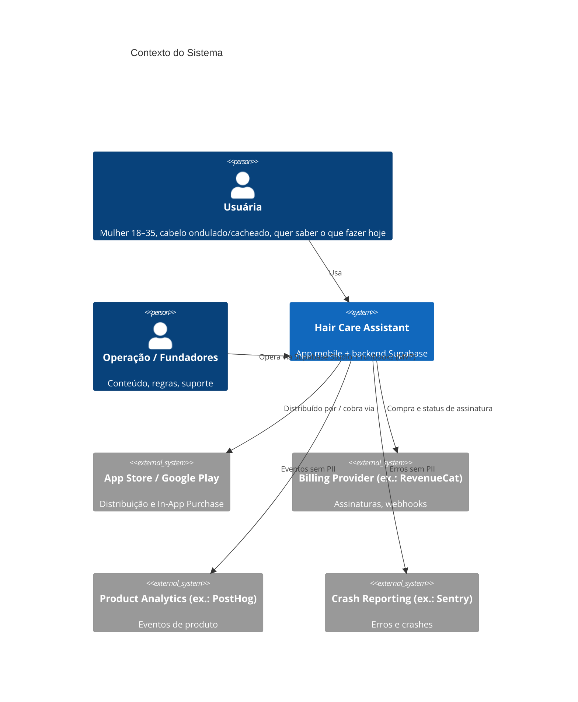
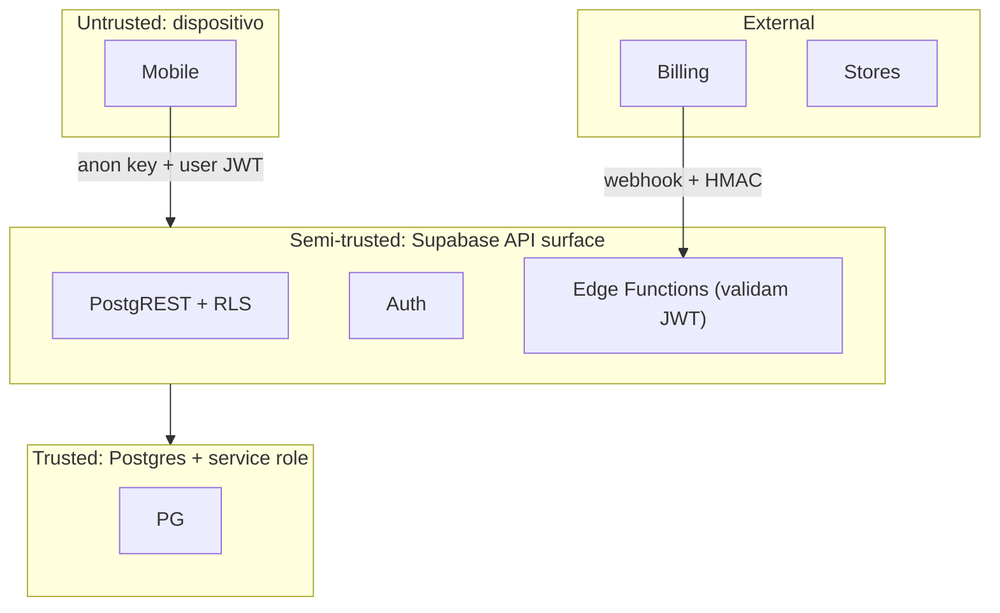

# SYSTEM ARCHITECTURE

| Campo | Valor |
|---|---|
| Status | Draft v0.1 — aguardando aprovação |
| Owner | Engenharia |
| Última atualização | 2026-08-26 |
| ADRs base | ADR-001 · ADR-002 · ADR-003 · ADR-004 · ADR-005 · ADR-007 · ADR-008 · ADR-009 |

---

## 1. Contexto (C4 — nível 1)



Integrações externas estão listadas para **contexto arquitetural**. Nenhuma é conectada na fase de fundação. Provedores específicos são decididos em ADR/SPEC próprios quando a fase correspondente chegar.

## 2. Containers (C4 — nível 2)

```mermaid
flowchart LR
    subgraph Device["Dispositivo da usuária"]
        M["apps/mobile<br/>Expo / React Native / TypeScript"]
        LN["Local Notifications<br/>(SO)"]
        SS["Secure Storage<br/>(session tokens)"]
    end
    subgraph Core["packages/core (TS puro)"]
        DE["DiagnosticEngine"]
        SE["ScheduleEngine"]
        ENT["Entitlements rules"]
        CT["Contracts / schemas (zod)"]
        EV["Event catalog"]
    end
    subgraph Supabase["Supabase (projeto por ambiente)"]
        AUTH["Auth (GoTrue)"]
        PG[("Postgres<br/>RLS + RPC + constraints")]
        EF["Edge Functions<br/>(generate-plan, billing-webhook)"]
        ST["Storage (futuro)"]
    end
    M --> Core
    EF --> Core
    M -->|anon key + JWT| AUTH
    M -->|PostgREST (RLS)| PG
    M -->|HTTPS + JWT| EF
    EF -->|service role, escopo mínimo| PG
    M --> LN
    M --> SS
    BILL["Billing Provider"] -->|webhook assinado| EF
```

### Responsabilidades por container

| Container | Responsabilidade | Não faz |
|---|---|---|
| `apps/mobile` | UI, navegação, estado de apresentação, orquestração de casos de uso, adaptadores de infraestrutura (Supabase SDK, notificações, analytics) | Regras de diagnóstico/cronograma/entitlement |
| `packages/core` | Domínio + Application: engines, invariantes, contratos, catálogo de eventos, erros tipados | Importar React, Expo, Supabase SDK, Deno APIs |
| Postgres | Fonte de verdade; integridade (constraints, FKs, unique); autorização (RLS); operações transacionais (RPC) | Lógica de diagnóstico/cronograma (fica no core) |
| Edge Functions | Execução **server-authoritative** do ScheduleEngine; receber webhooks; operações que exigem segredo | CRUD simples (vai direto via PostgREST + RLS) |
| Supabase Auth | Identidade, sessão, provedores sociais | Autorização de negócio |

## 3. Módulos (bounded contexts)

Detalhados em [DOMAIN-MAP](DOMAIN-MAP.md). Resumo:

| Contexto | Tipo | Core do MVP? |
|---|---|---|
| Identity & Account | Supporting | Sim |
| Hair Profile | Core | Sim |
| Diagnostic | **Core (regras)** | Sim |
| Schedule (Planning) | **Core (regras)** | Sim |
| Care Tracking (Calendar + Execution + Check-in) | Core | Sim |
| Progress | Supporting | Sim (mínimo) |
| Notifications | Supporting | Sim (local) |
| Content | Supporting | Sim (mínimo, seed) |
| Subscription & Entitlements | Supporting (crítico p/ segurança) | Sim (fase final) |
| Growth | Generic | Não (preparado) |
| Admin & Audit | Supporting | Parcial (audit sim, UI não) |

## 4. Arquitetura interna (camadas) — ver ADR-001

```
presentation  (apps/mobile/src/features/*/screens, components, hooks)
     ↓
application   (use cases / services: packages/core/src/<ctx>/application + apps/mobile/src/features/*/use-cases quando dependem de infra)
     ↓
domain        (packages/core/src/<ctx>/domain — entidades, VOs, engines, invariantes, erros)
     ↑
infrastructure (apps/mobile/src/infrastructure/* ; supabase/functions/* — implementam ports do application)
```

**Dependency Rule (obrigatória):**

1. `domain` não importa nada fora de `domain` (nem `application`).
2. `application` importa `domain`; define **ports** (interfaces) para persistência/notificação/analytics.
3. `infrastructure` implementa ports; importa `application` e `domain`; conhece Supabase/Expo.
4. `presentation` importa `application` (via hooks/facade); **nunca** importa Supabase SDK diretamente nem contém regra de negócio.
5. Regra física: `packages/core` tem `package.json` sem `react`, `react-native`, `expo`, `@supabase/*`. Um lint rule (`no-restricted-imports`) + `dependency-cruiser` (fase Foundation) reforçam.

Não é Clean Architecture acadêmica: não há "interactors", "presenters", "gateways" genéricos. Um caso de uso é uma função com dependências explícitas.

## 5. Fluxos de dados principais

### 5.1 Onboarding → Diagnóstico → Plano (server-authoritative)

```mermaid
sequenceDiagram
    participant U as Usuária
    participant M as Mobile
    participant C as core (client)
    participant EF as Edge Fn generate-plan
    participant DB as Postgres (RLS)
    U->>M: responde onboarding
    M->>C: validar respostas (zod) + preview local do diagnóstico (opcional, não persistido)
    M->>DB: INSERT hair_profiles (RLS: user_id = auth.uid())
    M->>EF: POST /generate-plan {hair_profile_id, idempotency_key}
    EF->>DB: SELECT hair_profile (valida ownership via auth.uid() do JWT)
    EF->>C: DiagnosticEngine.run(profile) → result (vX)
    EF->>C: ScheduleEngine.generate(result, ctx) → plan + scheduled cares (vY)
    EF->>DB: RPC create_plan_tx(...) — transação única: diagnostic_result + hair_plan + scheduled_cares; supersede plano anterior
    EF-->>M: {plan_id}
    M->>DB: SELECT plan + cares (RLS)
    M-->>U: "Este é o seu cronograma"
```

Racional: o app **pode** rodar o engine localmente para preview instantâneo (P01), mas o que é persistido é gerado no servidor com a mesma versão do engine (P09/P10). Detalhes: [ADR-007](../adr/ADR-007-schedule-engine-architecture.md).

### 5.2 Executar cuidado (idempotente)

```mermaid
sequenceDiagram
    participant M as Mobile
    participant DB as Postgres
    M->>M: gera client_execution_id (uuid v4) e persiste localmente ANTES do request
    M->>DB: RPC complete_care(scheduled_care_id, client_execution_id, executed_at, local_date)
    DB->>DB: valida ownership (auth.uid()), INSERT care_executions ON CONFLICT (client_execution_id) DO NOTHING; atualiza scheduled_care.status
    DB-->>M: execution_id (mesmo em retry)
    M->>M: optimistic UI já marcou como concluído; reconcilia
```

### 5.3 Reagendar

Reagendar **não** edita a data original: cria nova `scheduled_care` (ou marca a original como `rescheduled` com `rescheduled_to`). Histórico preservado. Regra em [DATA-MODEL §Scheduled Care](DATA-MODEL.md).

### 5.4 Assinatura → Entitlements

```
Store (IAP) → Billing Provider → webhook assinado → Edge Fn billing-webhook → subscriptions (service role)
                                                                             ↓
                                              RPC get_my_entitlements() (SECURITY INVOKER, lê subscriptions do próprio usuário)
                                                                             ↓
                                              Mobile EntitlementService (cache curto, fonte = servidor)
```

Regras premium sensíveis também são verificadas **no servidor** (RLS/RPC checa entitlement) — o cliente apenas decide o que mostrar.

## 6. Trust boundaries



| Fronteira | Regra |
|---|---|
| T0 → T1 | Tudo que vem do app é input não confiável: validado por schema (zod no cliente **e** constraints/RPC no servidor). |
| T1 → T2 | PostgREST só passa por RLS. Edge Functions usam service role **somente** para escrever em tabelas sem policy de escrita para usuários (`subscriptions`, `audit_log`, tabelas de plano) e sempre após validar o JWT do chamador. |
| T3 → T1 | Webhooks verificados por assinatura; idempotentes por `event_id`. |
| Segredos | Apenas em Edge Functions / CI secrets. Bundle mobile contém somente `SUPABASE_URL` e `SUPABASE_ANON_KEY` (públicas por design; segurança vem da RLS). |

## 7. Estratégia mobile — ver ADR-002

- Expo (managed workflow) + React Native + TypeScript estrito.
- Navegação: Expo Router (file-based) — rotas em `src/app`, telas de feature em `src/features`.
- Estado servidor: TanStack Query (cache, retry, offline-tolerant). Estado local leve: Zustand ou Context (decidir na SPEC de Foundation; padrão: Zustand somente para estado global não-servidor).
- Persistência local: `expo-secure-store` (tokens), MMKV/AsyncStorage (cache, fila de idempotência).
- Builds: EAS Build + EAS Update (OTA para JS apenas; nunca para alterar regras críticas sem versão de engine).
- Ambientes: `development`, `preview`(staging), `production` mapeados 1:1 para projetos Supabase.

## 8. Estratégia backend — ver ADR-004

| Mecanismo | Quando usar |
|---|---|
| PostgREST direto (SDK) + RLS | Leituras e escritas simples de dados da própria usuária |
| Postgres Function (RPC) `SECURITY INVOKER` | Operações transacionais multi-tabela do próprio usuário (`complete_care`, `reschedule_care`, `get_my_entitlements`) |
| Postgres Function `SECURITY DEFINER` | Exceção justificada em ADR/SPEC (ex.: `request_account_deletion`); `search_path` fixo; `REVOKE EXECUTE FROM public` |
| Edge Function | Precisa de segredo, de chamada externa, ou de executar o engine TS server-side (`generate-plan`, `billing-webhook`) |
| Trigger | Apenas para integridade (updated_at, status derivado, audit de tabelas sensíveis). Nunca para regra de negócio de produto |
| Cron (pg_cron) | Futuro: expiração de trials, limpeza de deletion requests |

Migrations: Supabase CLI, schema-as-code, uma migration por SPEC/mudança. Ver [ENGINEERING-WORKFLOW](ENGINEERING-WORKFLOW.md).

## 9. Estratégia admin — ver ADR-003

MVP: **sem app admin**. Operação via Supabase Studio (com acesso restrito e MFA no dashboard), scripts SQL versionados em `supabase/ops/` (somente leitura ou via migration) e runbooks em `docs/runbooks/`. Toda ação administrativa relevante passa por migration/seed revisada em PR ou por RPC administrativa que grava em `audit_log`.

Quando houver necessidade real (conteúdo frequente, suporte), criar `apps/admin` (web, Next/Vite + mesmo `packages/core`) com autorização via **custom claims** (`app_role: admin`) emitidas por Auth Hook, MFA obrigatório e RLS específica. Detalhes em [SECURITY-BASELINE §Admin](../security/SECURITY-BASELINE.md).

## 10. Arquitetura de erros

Em `packages/core/src/shared/errors.ts` (fase Foundation):

| Classe | Uso | Exposição à usuária |
|---|---|---|
| `DomainError` | Invariante violada (ex.: plano sem cuidados) | Mensagem genérica; log completo |
| `ValidationError` | Input inválido (schema) | Campo + mensagem amigável |
| `AuthorizationError` | Não autorizado / RLS negou | "Você não tem acesso" — sem detalhes |
| `NotFoundError` | Recurso inexistente **ou** inacessível (não distinguir — evita enumeração) | "Não encontrado" |
| `ConflictError` | Idempotência / versão | Reconciliar silenciosamente quando possível |
| `InfrastructureError` | Rede, Supabase, provider | "Algo deu errado, tente novamente" + retry |

Erros nunca carregam tokens, SQL, stack para a UI. Mapeamento PostgREST/Postgres → erro tipado ocorre num único adapter em `infrastructure/supabase/errors.ts`.

## 11. Rede instável / offline (pragmático)

- Leituras: cache TanStack Query com `staleTime` por recurso; tela "Hoje" renderiza do cache imediatamente.
- Escritas críticas (`complete_care`, `checkin`): **idempotency key gerada e persistida localmente antes do envio**; fila simples com retry exponencial; optimistic UI.
- Sem offline-first completo (sem CRDT, sem sync engine) no MVP.
- Conflito multi-dispositivo: última escrita vence para preferências; execuções são append-only (não conflitam).

## 12. Observabilidade (estratégia, sem integrar ainda)

| Camada | Ferramenta candidata | Regra |
|---|---|---|
| Crash / erro mobile | Sentry (avaliar) | Scrub de PII; sem tokens; `user.id` opaco apenas |
| Erro backend | Supabase logs + Sentry em Edge Functions | Sem payloads com dados pessoais |
| Product analytics | PostHog (avaliar) — via port `AnalyticsPort` | Eventos do catálogo apenas; sem PII em propriedades |
| Performance | Sentry perf / EAS Insights | — |
| Auditoria | `audit_log` (Postgres) | Ações sensíveis apenas |

## 13. Perguntas de fitness (a arquitetura deve responder)

| Pergunta | Resposta |
|---|---|
| Onde está esta regra? | `packages/core/src/<contexto>/domain` — engines e invariantes |
| Quem pode alterar este dado? | [SUPABASE-RLS-STRATEGY](../security/SUPABASE-RLS-STRATEGY.md) matriz por tabela |
| Qual módulo possui este comportamento? | [DOMAIN-MAP](DOMAIN-MAP.md) |
| Qual SPEC define isso? | `docs/specs/SPEC-xxx` — índice em `docs/specs/README.md` |
| Qual ADR decidiu isso? | `docs/adr/` — índice em `docs/adr/README.md` |
| Como testamos isso? | [ENGINEERING-WORKFLOW §Testes](ENGINEERING-WORKFLOW.md) |
