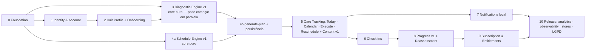

# MVP ROADMAP

| Campo | Valor |
|---|---|
| Status | Draft v0.1 — aguardando aprovação |
| Princípio | Cada fase entrega algo testável end-to-end; nenhuma fase começa sem SPEC aprovada |

## 1. Grafo de dependências

Racional da ordem:
- **Engines antes de UI** (fases 3/4a): são puros, testáveis sem app, e são o maior risco de produto (regras capilares). Podem ser desenvolvidos em paralelo com Identity/Onboarding.
- **Check-ins depois de Execution**: dependem de `care_executions`.
- **Notifications depois de Care Tracking**: intents precisam de plano e execuções.
- **Subscription por último antes do release**: valor primeiro (P01); entitlements já existem como stub free desde a Foundation.
- **Analytics provider no fim, catálogo desde o início**: eventos são emitidos para adapter no-op desde a fase 1; provider entra na fase 10 com consentimento.

## 2. Fases

### Fase 0 — Foundation (SPEC-000) · ~1 semana
Skeleton `apps/mobile` (vazio, sem telas de produto) + `packages/core` (shared: errors, time, result; contextos vazios com README) · pnpm workspaces · TS strict · ESLint boundaries + dependency-cruiser · Vitest/Jest · Supabase local + migration `0000_foundation` (extensões, `set_updated_at` — `is_admin`/`has_entitlement` movidos para SPEC-001/010, ver SPEC-000 §8) · pgTAP + checks de RLS em CI · GitHub Actions · branch protection · CODEOWNERS · `.claude/skills` (5) · runbooks base · spike: Edge Function importando `packages/core`.
**Saída:** CI verde num repo sem produto; regra de dependência verificável.
**Status (2026-08-26): IMPLEMENTADA — ready for merge** (PR #1; `ci`, `core-deno`, `supabase-test` verdes; AC12 deferred, D-50). Próxima fase permitida: 1 — Identity (SPEC-001, ainda não autorizada).

### Fase 1 — Identity & Account (SPEC-001) · ~1–2 semanas
Auth (Apple, Google, email) · sessão segura · `profiles` + trigger · timezone/locale · consentimentos · exclusão de conta (RPC + purga) · testes RLS.
**Saída:** usuária cria conta, entra, sai, exclui.

### Fase 2 — Hair Profile + Onboarding (SPEC-002) · ~1–2 semanas
Perguntas (≤ 8) · `hair_profiles` versionado · validação zod + CHECK · tela de onboarding com estados · evento `onboarding_*`.
**Saída:** perfil salvo; "preview" ainda não.

### Fase 3 — Diagnostic/Assessment Engine v1 (**folded into SPEC-004** — D-66/ADR-007 A2) · (sem entrega isolada)
Regras v1 com especialista capilar · `runDiagnostic`/assessment puro · reason codes · golden tests · contratos. **A entrega MVP acontece na vertical slice da Fase 4/SPEC-004** (o resultado da avaliação tem um único consumidor, o Schedule). O módulo `packages/core/src/diagnostic/` permanece separado.
**Saída:** absorvida pela Fase 4.

### Fase 4 — Schedule Engine v1 + generate-plan (SPEC-004) · ~2 semanas
4a: `generateSchedule` puro (ciclo H/N/R por necessidade, frequência de lavagem, janela 8 semanas, referenceDate injetado, golden tests).
4b: Edge Function `generate-plan` + RPC `create_plan_tx` + tabelas `diagnostic_results`, `hair_plans`, `scheduled_cares` + RLS + rate limit + preview no cliente + tela "Este é o seu cronograma".
**Saída:** H1 mensurável (onboarding → plano).

### Fase 5 — Care Tracking + Content v1 (SPEC-005, SPEC-007) · ~2 semanas — **CONCLUÍDA (2026-08-28)**
Tela Hoje · calendário (planejado vs executado) · `complete_care` idempotente · reagendar/pular · desfazer · conteúdo contextual por care_type (seed) · eventos.
**Saída:** loop diário completo; H2 mensurável. **Entregue:** SPEC-005 (PR #14) — Hoje/atrasado/próximos/histórico, concluir/pular/reagendar/desfazer; SPEC-007 (PR #19) — "Como fazer" por care type. **Calendário mensal e execução avulsa continuam adiados** (sem consumidor). Próximas fatias disponíveis: F6 (SPEC-006 Check-ins) e F7 (SPEC-008 Notifications) — o grafo §1 mostra as duas dependendo só de F5.

### Fase 6 — Check-ins (SPEC-006) · ~1 semana — **CONCLUÍDA (2026-08-28)**
`submit_checkin` · UI de 3–4 toques · evento.
**Saída:** H4 mensurável. **Entregue:** SPEC-006 (PR #21) — uma pergunta ("Como ficou?", 1..5) ancorada na execução efetiva, idempotente, append-only, com retorno imediato na Hoje. **Adiado:** as outras 4 dimensões e a nota livre (necessity review D-73 — entram na SPEC-009 como colunas anuláveis, sem migração de dados). Próxima fatia disponível: F7 (SPEC-008 Notifications) — **exige aprovação humana da dependência `expo-notifications`** (CLAUDE.md §4).

### Fase 7 — Notifications (SPEC-008) · ~1 semana — **CONCLUÍDA (2026-08-28)**
Intents puros · preferências · permissão · canal local · reconciliação · deep links validados.
**Saída:** H3 mensurável (ON vs OFF). **Entregue:** SPEC-008 (PR #24) — canal local, opt-in duplo, 3 intents puros (`care_today`, `care_overdue`, `checkin_pending`), ≤2/dia, horizonte de 14 dias, reconciliação idempotente, texto sem PII. **Adiado:** `reassessment_due` (depende da SPEC-014), `habit_recovery` (sem dado que justifique), push remoto, deep link parametrizado. **Próxima fatia: F8 — SPEC-009 (Progress) + SPEC-014 (Reassessment)**, agora com check-ins e execuções acumulando dados.

### Fase 8 — Progress v1 + Reassessment (SPEC-009, SPEC-014) · ~1–2 semanas
Adesão, histórico, streak (se aprovado) · reavaliar → novo diagnóstico → novo plano (supersede).
**Saída:** loop mensal.

### Fase 9 — Subscription & Entitlements (SPEC-010) · ~2 semanas
Provider (RevenueCat candidato) · webhook · `subscriptions` · `has_entitlement` · paywall · 1–2 features premium (insights avançados, customização) · sandbox testing.
**Saída:** H5 mensurável.

### Fase 10 — Release (SPEC-011, 012, 013) · ~1–2 semanas
Analytics provider + consentimento · crash reporting · privacy labels · política de privacidade · store listings · E2E Maestro da jornada crítica · beta (TestFlight / internal testing) · lançamento.

**Total estimado: ~14–18 semanas** com 1 dev + agente, sem contar validação com especialista capilar e design.

## 3. Pós-MVP (roadmap, sem compromisso)
Push remoto · exportação de dados (UI) · share cards / referral / deep links (Growth) · admin web (`apps/admin`) · regras configuráveis via admin · "o que tenho em casa" (produtos) · fotos e análise · AI assistant · creators/afiliados · comunidade · B2B/salões.

## 4. Marcos de decisão (checkpoints humanos)
- ✅ Aprovação da fundação (este pacote).
- Após F4: revisar regras dos engines com especialista. **Re-escopado por D-67/D-68 (2026-08-27):** as regras V1 são `candidate` — dev/internal beta liberados, então este checkpoint **não bloqueia F5**. O sign-off de domínio (`candidate → validated`) permanece **obrigatório antes do PUBLIC RELEASE** (D-26 / ADR-007 A1 / SPEC-004 OQ-REL).
- Após F7: decidir streaks (gamificação) com base em dados qualitativos.
- Antes de F9: decidir provider de billing e preços.
- Antes de F10: revisão jurídica LGPD (base legal para analytics).
