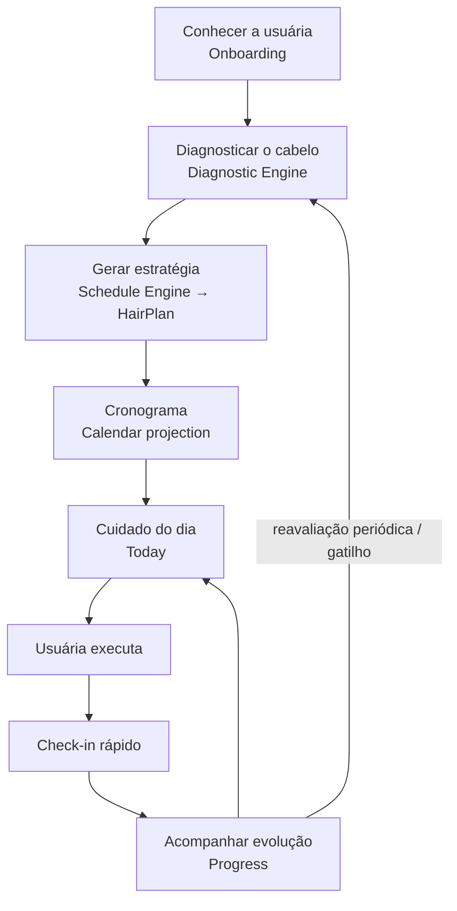

# PRODUCT BRIEF — Assistente Pessoal de Cuidados Capilares

| Campo | Valor |
|---|---|
| Status | Draft v0.1 — aguardando aprovação |
| Owner | Produto / Fundadores |
| Última atualização | 2026-08-26 |
| Relacionados | [MVP-ROADMAP](MVP-ROADMAP.md) · [SYSTEM-ARCHITECTURE](../architecture/SYSTEM-ARCHITECTURE.md) · [DOMAIN-MAP](../architecture/DOMAIN-MAP.md) |

> Nome de trabalho: **"Hairo"** (placeholder — nome definitivo é decisão de produto/marca). Nos documentos técnicos usamos `app` / `mobile`.

---

## 1. Visão

> Um assistente pessoal que entende o cabelo da usuária, cria uma rotina de cuidados e diz **o que fazer, quando fazer e por quê**.

O produto **não é** "um calendário de cronograma capilar". O calendário é uma projeção; o valor está na **decisão tomada pelo sistema em nome da usuária**.

A pergunta que o app responde todos os dias:

> **"O que eu faço no meu cabelo hoje?"**

## 2. Problema

Usuárias consomem muito conteúdo sobre cabelo (TikTok, Instagram, creators), compram produtos por impulso e **não possuem estratégia de uso**. Cronograma capilar (hidratação / nutrição / reconstrução) exige entendimento técnico que a maioria não tem nem quer ter.

Dor central (verbatim do ICP):

> "Vejo várias dicas e compro produtos, mas não sei exatamente o que meu cabelo precisa nem quando devo usar cada coisa."

Consequências observáveis: produtos parados, resultados inconsistentes, frustração, abandono da rotina.

## 3. ICP (Ideal Customer Profile)

| Dimensão | Descrição |
|---|---|
| Segmento | B2C |
| Gênero | Mulheres (linguagem do produto no feminino por padrão; a arquitetura **não** armazena gênero como dado obrigatório) |
| Idade foco | 18–35 (expansível até ~40) |
| Cabelo | Predominantemente ondulado, cacheado ou em transição capilar |
| Comportamento | Alto consumo de TikTok/Instagram; compra produtos por recomendação de creators |
| Contexto | Rotina corrida, pouco tempo para estudar; quer resposta pronta |
| Conhecimento | Baixo/médio sobre cronograma capilar; não quer virar especialista |
| Mercado inicial | Brasil (pt-BR, LGPD, múltiplos fusos dentro do país) |

### Anti-persona (não otimizar para)
- Profissionais de salão / cabeleireiras (B2B futuro).
- Usuárias que querem controle manual total de cada etapa ("power user de planilha").

## 4. Jobs-to-be-Done

| # | Job | Tipo |
|---|---|---|
| J1 | "Antes de lavar o cabelo quero saber exatamente qual cuidado fazer hoje, sem pensar." | Funcional (core) |
| J2 | "Quero que alguém organize meu cronograma a partir do **meu** cabelo, e não de um cabelo genérico." | Funcional |
| J3 | "Quero ser lembrada no momento certo, sem ser incomodada." | Funcional |
| J4 | "Quero sentir que estou evoluindo e que meu esforço está dando resultado." | Emocional |
| J5 | "Quero entender por que estou fazendo aquilo, em 10 segundos." | Educacional |
| J6 | "Quero mostrar minha rotina/progresso para amigas e nas redes." | Social (pós-MVP) |

## 5. Proposta de valor

> **Você não precisa entender de cronograma capilar. O aplicativo entende seu cabelo e organiza sua rotina por você.**

Diferenciação frente às referências (apenas padrões de produto foram estudados; nenhum asset, texto, tela, marca ou código é reutilizado):

| Referência | O que aprendemos | O que fazemos diferente |
|---|---|---|
| Meu Cronograma Capilar | Modelo mental H/N/R, calendário, catálogo de tratamentos | O sistema **decide** por padrão; a usuária ajusta, não configura do zero |
| Flo | Onboarding curto, personalização percebida, check-ins diários, loops de retenção, premium baseado em insights | Mesmos padrões aplicados a um domínio onde a "ação do dia" é concreta (o cuidado), não apenas registro |

## 6. Core Loop

- **Loop diário (hábito):** abrir → ver "hoje" → executar → check-in (≤ 15 s).
- **Loop semanal/mensal:** progresso → reavaliação → cronograma evolui.

## 7. Hipóteses do MVP e validação

| ID | Hipótese | Métrica | Sinal mínimo (a calibrar) |
|---|---|---|---|
| H1 | Usuárias querem um cronograma personalizado | `onboarding_completed / onboarding_started`; `schedule_created / diagnostic_completed` | ≥ 60% concluem onboarding + diagnóstico |
| H2 | Usuárias voltam para ver o cuidado do dia | D1/D7/D30; `care_viewed` por usuária/semana | D7 ≥ 25% |
| H3 | Lembretes e calendário aumentam adesão | Adesão (executados/planejados) com notificação ON vs OFF | Δ ≥ 15 p.p. |
| H4 | Check-ins simples aumentam percepção de personalização | `checkin_completed / care_completed`; micro-survey in-app | ≥ 50% dos cuidados com check-in |
| H5 | Existe disposição para pagar | `subscription_viewed → trial_started → subscription_started` | Trial→paid ≥ 20% |

## 8. Métricas

- **North Star:** *cuidados executados por usuária ativa por semana* (mede valor entregue, não apenas abertura).
- Ativação: % que chega a "Este é o seu cronograma" em ≤ 5 min.
- Retenção: D1, D7, D30.
- Adesão: executados / planejados (janelas 7d e 30d).
- Engajamento de check-in.
- Conversão: view → trial → paid; churn mensal.
- Qualidade: crash-free sessions, latência de geração do plano.

Taxonomia formal de eventos: [ADR-010](../adr/ADR-010-analytics-architecture.md).

## 9. Escopo do MVP

### Inclui
1. Conta: cadastro, login, recuperação, exclusão da conta.
2. Onboarding curto (≤ 8 perguntas) → Hair Profile.
3. Diagnóstico versionado → resultado explicável ("seu cabelo precisa de mais X").
4. Geração automática do plano (ciclo H/N/R) + projeção em calendário.
5. Tela "Hoje": cuidado do dia, o porquê, como fazer (conteúdo contextual).
6. Executar cuidado (idempotente) + check-in de 3–4 toques.
7. Reagendar / pular cuidado sem perder histórico.
8. Lembretes locais: tratamento hoje, check-in pendente, tratamento atrasado.
9. Progresso simples: adesão, histórico, streak (se aprovado).
10. Paywall Free/Trial/Premium com entitlements server-side.
11. Reavaliação do cabelo (novo diagnóstico → novo plano, histórico preservado).

### Non-goals (MVP)
- Comunidade, feed social, mensagens, comentários, seguidores.
- Marketplace / e-commerce / afiliados / recomendação de produtos por marca.
- IA generativa conversacional; diagnóstico por câmera/foto.
- Integração com salões / B2B.
- Admin web completo (operação via Supabase Studio + runbooks no MVP — ver [ADR-003](../adr/ADR-003-repository-strategy.md)).
- Push remoto server-driven (lembretes locais bastam para validar H3 — ver [ADR-009](../adr/ADR-009-notification-architecture.md)).
- Multi-idioma além de pt-BR.

## 10. Princípios de produto

P01 Time-to-Value baixo · P02 Complexidade progressiva · P03 Mobile first · P04 Daily habit · P05 Personalização percebida · P06 Baixa carga cognitiva · P07 Growth built-in · P08 Privacy by design · P09 Security by default · P10 Server-enforced business rules.

## 11. Riscos de produto

| Risco | Prob. | Impacto | Mitigação |
|---|---|---|---|
| Diagnóstico percebido como genérico (quebra P05) | Média | Alto | Resultado explicável; linguagem específica; regras revisadas por especialista capilar |
| Rotina exige produtos que a usuária não tem | Alta | Médio | Plano orienta por **função** (hidratar) e não por produto; "o que você tem em casa" em fase posterior |
| Notificações viram spam → desinstalação | Média | Alto | Opt-in, horário escolhido, frequência limitada por regra central |
| Regras capilares sem validação especializada | Média | Alto | Engine versionado, tabelas de regras revisáveis, disclaimer não-médico |
| Paywall cedo demais mata ativação | Média | Alto | Valor antes do paywall; premium em insights, não no core loop |
| Cobrança fora da loja → rejeição Apple/Google | Alta se ignorado | Alto | IAP nativo via provider ([ADR-011](../adr/ADR-011-subscription-entitlements.md)) |
| Lock-in Supabase | Baixa | Médio | Domínio isolado da infra; schema-as-code |
| Dados pessoais sem base legal (LGPD) | Baixa | Alto | Data minimization, consentimento, exclusão/exportação |

## 12. Glossário (Ubiquitous Language)

| Termo | Definição |
|---|---|
| **Hair Profile** | Representação estruturada das características e hábitos do cabelo. Versionado (append-only). |
| **Diagnostic Result** | Avaliação estruturada produzida pelo Diagnostic Engine. Imutável; carrega `algorithm_version`. |
| **Hair Plan** | Estratégia de cuidados (ex.: ciclo H-H-N-H-R) gerada pelo Schedule Engine. Carrega `algorithm_version`; nunca é editado retroativamente — é substituído. |
| **Scheduled Care** | Instância **planejada** de um cuidado numa data local ("Hidratação em 26/08"). |
| **Care Execution** | Registro de que um cuidado foi **realizado** (timestamp real). Nunca sobrescrito. |
| **Check-in** | Feedback rápido após execução. |
| **Care Type** | Categoria do cuidado: Hidratação, Nutrição, Reconstrução (+ extensível). |
| **Today** | O cuidado (ou a ausência de cuidado) do **dia local** da usuária. |
| **Entitlement** | Capacidade concedida à usuária (ex.: `advanced_insights`), derivada server-side da assinatura. |
